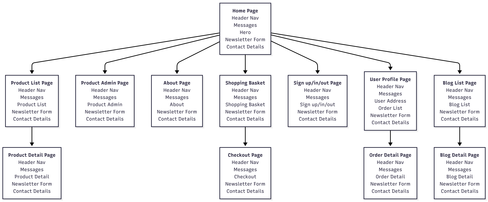

# Scentifique

- Live website
- Live admin login

Scentifique is a fictional manufacturer and retailer of handmade candles. Candles are made to order, and customers can select from a range of styles, colours and fragrances.

Previously the company had no website or shop, so candles were sold by mail order. The owner would leave leaflets at local hairdressers, nail bars and other relevant local businesses, and people who frequented those establishments could read the leaflets, take them home and (hopefully) order some candles.

That route to market is very limited and it severely restricted the company's growth potential. To resolve this issue, Scentifique's owner comissioned me to build the company a bespoke e-commerce website where the business could be promoted and orders could be received from across the UK.

[IMAGE OF WEBSITE RESPONSIVENESS]

## Table of Contents

- [User Experience Design](#user-experience-design)

## User Experience Design

I created the site's high-level design using the "five planes" method.

### Strategy Plane

The strategy plane is where we begin to understand what the business owner wants from the website and what its users will want.

#### Business Owner Goals

- Primary goal
  - To increase revenue and profit, so the business owner makes more money.
  - To increase revenue and profit, so Scentifique's employees have more secure jobs.
  - To increase the number of customers, so more people can enjoy the company's products.

- Supporting goals
  - To spread awareness of the business beyond the local area, so that more people enter the top of the sales funnel.
  - To enable people from across the UK to buy Scentifique's products online, as that's much more convenient than having to order from a paper leaflet, which should improve the visitor to customer conversion rate.
  - To publish blog posts about scented candles, so that people who are searching online for information about scented candles can easily find the business.
  - To send a regular e-newsletter to potential customers, so the business remains top of mind with customers and leads.
  - To maintain the company's arts & crafts style, as this has proven to be popular with the company's existing customers.

#### User Primary Goals

- Primary goals
  - To enjoy the beauty, fragrance and calming glow of high-quality candles.
  - To give candles as a gift to someone else.

- Supporting goals
  - To buy candles online, so they don’t have to go to a shop.
  - To learn about candles, so they how the different waxes burn, which fragrances work together, etc.
  - To be able to select the candles exact style, colour and fragrance, so their candles are bespoke and not just another candle off the production line.
  - To be part of a community of candle lovers.

## Scope Plane

Unsurprisingly, the scope plane is where we decide what functionality is within scope and what falls outside the scope of the project.

### Epics

For this initial version of the site, there were three epics (high-level requirements):

- Epic: An attractive, trustworthy website
  - As a user, I can see a website that builds my confidence and trust in the company, so I feel safe enough to make an online purchase through the site.

-  Epic: E-commerce capabilities
  - As a user, I can select and purchase candles through the website, so I don't have to find one of the company's mail order leaflets.

- Epic: E-newsletter
  - As a user, I can read and subscribe to articles covering various candle-related topics, so I can become more knowledgeable about candles and stay up to date with the latest trends and offers.

Given the length of the project's overall timebox, I thought one-week sprints would work well. The above epics seemed to be too large to fit within a single one-week sprint, so I broke them down into user stories, listed below.

### User Stories

Note that the user stories are prioritised using the MoSCoW system of must-have, should-have and could-have.
Also, the user story numbers are taken from the related [GitHub Project](https://github.com/users/John-Kingham/projects/15).

- Epic 1: An attractive, trustworthy website
  - #1 (must-have): As a User, I can see a website that looks good and works well on all screen sizes, so I’m not put off by a poor user experience.
  - #2 (must-have): As a User, I can see useful information about the company, so I can decide if it’s trustworthy enough to buy from.
  - #13 (must-have): As a User, I can easily find the website through a search engine, so I can visit the site and buy its products.

- Epic 2: E-commerce capabilities
  - #4 (must-have): As a User, I can see a list of products on the site, so I can choose products to buy.
  - #6 (must-have): As a User, I have a “basket” where I can add or remove multiple items, so I can purchase multiple items in one transaction.
  - #7 (must-have): As a User, I can purchase items in my “basket” using a credit/debit card, so I don’t have to send a cheque or cash.
  - #3 (must-have): As a User, I can see helpful feedback on each important action I take on the site, so that I always know whether my actions were successful or not.
  - #8 (must-have): As a Logged-in User, I can save my address, so I don’t have to enter it manually for future orders.
  - #9 (should-have): As a Logged-in User, I can see my previous orders, so I know how much I’ve spent.
  - #10 (could-have): As a User, I can sort and filter products on the website by price, size and other factors, so I can easily find the products I’m looking for.
  - #5 (must-have): As an Admin, I can create, update and delete product information through a well-designed front end, so I don’t have to switch back and forth between the site's front-end and admin area.

- Epic 3: E-newsletter
  - #11 (must-have): As a User, I can sign-up to a regular email newsletter, so I can find out more about candlemaking and the latest candles and offers.
  - #12 (could-have): As a User, I can read blog posts about candles, so I can learn more about candles and how to get the best out of them.

[NOTE ANY USER STORIES THAT DIDN'T MAKE IT INTO THE DEPLOYED SITE]

## Structure Plane

In the structure plane, we begin to outline the solution at a high level. The diagram below shows how the site's interface is structured into pages and sections.

Each section helps to fulfill one or more user stories, and the relationship between webpage sections and user stories is explained in the Features section below.

[NOTE ANY PAGES THAT DIDN'T MAKE IT INTO THE DEPLOYED SITE]

