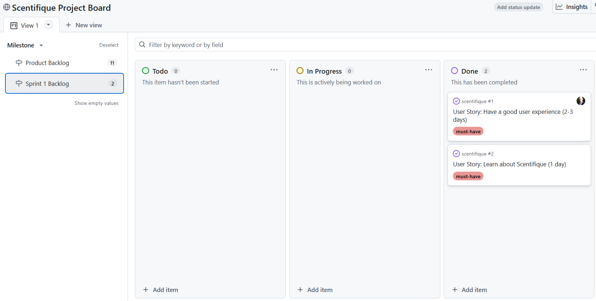

# Scentifique

- [Live site](https://scentifique-f390ca153bd2.herokuapp.com/)
- [Live admin login](https://scentifique-f390ca153bd2.herokuapp.com/admin/)

Scentifique is a fictional manufacturer and retailer of luxury scented candles. Candles are handmade to order, and customers can select from a range of styles, colours and fragrances.

Previously the company had no website or shop, so candles were sold at local craft fairs. That route to market is very limited and severely restricted the company's growth potential. 

To support the growth of the business, Scentifique's owner comissioned me to build a bespoke e-commerce website where the business could be promoted and orders could be received from across the UK.

## Table of Contents

- [User Experience Design](#user-experience-design)
- [Data Model](#data-model)
- [Technologies Used](#technologies-used)
- [Features](#features)
- [Project Management](#project-management)
- [Testing](#testing)
- [Deployment](#deployment)
- [Credits](#credits)

## User Experience Design

I created the site's high-level design using the "five planes" method.

### Strategy Plane

The strategy plane is where we begin to understand what the business owner wants from the website and what its users will want.

#### Business Owner Goals

- Primary goal
  - To increase revenue and profit, so the business owner makes more money.
  - To increase revenue and profit, so Scentifique's employees have more secure jobs.
  - To increase the number of customers, so more people can enjoy the company's products.

- Supporting goals
  - To spread awareness of the business beyond the local area, so that more people enter the top of the sales funnel.
  - To enable people from across the UK to buy Scentifique's products online, as that's much more convenient than having to visit a craft fair, which should improve the visitor to customer conversion rate.
  - To publish blog posts about scented candles, so that people who are searching online for information about scented candles can easily find the business.
  - To send a regular e-newsletter to potential customers, so the business remains top of mind with customers and leads.
  - To maintain the company's arts & crafts style, as this has proven to be popular with existing customers.

#### User Primary Goals

- Primary goals
  - To enjoy the beauty and fragrance of luxury candles.
  - To give luxury scented candles as a gift.

- Supporting goals
  - To buy candles online, so they don’t have to go to a shop.
  - To learn about candles, so they how the different waxes burn, which fragrances work together, etc.
  - To be able to select a candle's style, colour and fragrance, so their candles are bespoke and not just another off-the-shelf product.
  - To be part of a community of luxury scented candle lovers.

## Scope Plane

The scope plane is where we decide what functionality is within scope and what falls outside the scope of the project.

### Epics

For the initial version of the site, there were three epics (high-level requirements):

- Epic: An attractive, trustworthy website
  - As a user, I can see a website that builds my confidence and trust in the company, so I feel safe enough to make an online purchase through the site.

-  Epic: E-commerce capabilities
  - As a user, I can select and purchase candles through the website, so I don't have to visit a craft fair to but candles from Scentifique.

- Epic: E-newsletter
  - As a user, I can read and subscribe to blog posts covering various candle-related topics, so I can become more knowledgeable about candles and stay up to date with the latest trends and offers.

Given the length of the project's overall timebox, I thought one-week sprints would work well. The above epics seemed to be too large to fit within a single one-week sprint, so I broke them down into user stories, listed below.

### User Stories

Note that the user stories are prioritised using the MoSCoW system of must-have, should-have and could-have.

Also, the user story numbers are taken from the related [GitHub Project](https://github.com/users/John-Kingham/projects/15).

- Epic 1: An attractive, trustworthy website
  - #1 (must-have): As a User, I can see a website that looks good and works well on all screen sizes, so I’m not put off by a poor user experience.
  - #2 (must-have): As a User, I can see useful information about the company, so I can decide if it’s trustworthy enough to buy from.
  - #13 (must-have): As a User, I can easily find the website through a search engine, so I can visit the site and buy its products.

- Epic 2: E-commerce capabilities
  - #4 (must-have): As a User, I can see a list of products on the site, so I can choose products to buy.
  - #6 (must-have): As a User, I have a “basket” where I can add or remove multiple items, so I can purchase multiple items in one transaction.
  - #7 (must-have): As a User, I can purchase items in my “basket” using a credit/debit card, so I don’t have to send a cheque or cash.
  - #3 (must-have): As a User, I can see helpful feedback on each important action I take on the site, so that I always know whether my actions were successful or not.
  - #8 (must-have): As a Logged-in User, I can save my address, so I don’t have to enter it manually for future orders.
  - #9 (should-have): As a Logged-in User, I can see my previous orders, so I know how much I’ve spent.
  - #10 (could-have): As a User, I can sort and filter products on the website by price, size and other factors, so I can easily find the products I’m looking for.
  - #5 (must-have): As an Admin, I can create, update and delete product information through a well-designed front end, so I don’t have to switch back and forth between the site's front-end and admin area.

- Epic 3: E-newsletter
  - #11 (must-have): As a User, I can sign-up to a regular email newsletter, so I can find out more about candlemaking and the latest candles and offers.
  - #12 (could-have): As a User, I can read blog posts about candles, so I can learn more about candles and how to get the best out of them.

## Structure Plane

In the structure plane, we begin to outline the solution at a high level. The diagram below shows how the site's interface is structured into pages and sections.

Each section helps to fulfill one or more user stories, and the relationship between webpage sections and user stories is explained in the Features section below.

At this stage, I also started to think about the structure of the database, and this is detailed in the Data Model section below.

Note: The Order Detail, Blog List and Blog Details pages didn't make it into the current site and have been deferred to future sprints.

## Skeleton Plane

In the skeleton plane, we add detail to the structure developed in the structure plane.

In this case, I used wireframes to add further detail to each web page. These wireframes were for general guidance purposes only and the site's actual design has minor differences from the wireframes.

### Mobile Wireframes

Mobile wireframes

### Tablet Wireframes

Tablet wireframes

### Desktop Wireframes

Desktop wireframes

## Surface Plane

This is the final plane, where we add colour and other fine details to our bare wireframes.

### Colour Palette

The site uses two primary colours, inspired by the arts & crafts wallpapers of William Morris, examples of which are available at sites like [Wall passion](https://www.wallpassion.co.uk/william-morris).

- Red - #A15355
- Green - #4A764B

The site uses black for most text and white for some backgrounds. It also uses Bootstrap [Bootstrap](https://getbootstrap.com/) default colours for buttons and various feedback messages.

### Custom Fonts

The site uses two custom fonts from Google Fonts.

- Headings - [Quintessential](https://fonts.google.com/specimen/Quintessential)
- Body - [Nunito](https://fonts.google.com/specimen/Nunito)

### Content

All text content was generated by me, either alone or working with [Microsoft Co-Pilot](https://copilot.microsoft.com/).

## Data Model

To fulfil the project's requirements, the site has a database.

### Entity Relationship Diagram

During the structure and skeleton planes I sketched out the following entity relationship diagram.

At this stage, the fields are simplified and use generic types such as `number` or `string`. The exact fields and field types were decided during the iterative development phase and are detailed below.

### Implemented Database Schema

Note: The BlogPost table didn't make it into the final design, as the blog functionality was deferred until a future sprint.

#### about.About Model

|Field|Type|Attributes|
|---|---|---|
|title|CharField|max_length=200, unique=True|
|content|TextField|blank=True|
|updated|DateTimeField|auto_now=True|

#### checkout.Order Model

|Field|Type|Attributes|
|---|---|---|
|order_number|CharField|max_length=32, null=False, editable=False|
|user_profile|ForeignKey|to=UserProfile, on_delete=models.SET_NULL, null=True, blank=True, related_name="orders"|
|full_name|CharField|max_length=50, null=False, blank=False|
| email | EmailField | max_length=254, null=False, blank=False |
| phone_number | CharField | max_length=20, null=False, blank=False |
| country | CountryField | blank_label="Country *", null=False, blank=False |
| postcode | CharField | max_length=20, null=True, blank=True |
| town_or_city | CharField | max_length=40, null=False, blank=False |
| street_address1 | CharField | max_length=80, null=False, blank=False |
| street_address2 | CharField | max_length=80, null=True, blank=True |
| county | CharField | max_length=80, null=True, blank=True |
| date | DateTimeField | auto_now_add=True |
| delivery | DecimalField | max_digits=6, decimal_places=2, null=False, default=0 |
| lineitems_total | DecimalField | max_digits=10, decimal_places=2, null=False, default=0 |
| grand_total | DecimalField | max_digits=10, decimal_places=2, null=False, default=0 |
| original_cart | TextField | null=False, blank=False, default="" |
| stripe_pi_id | CharField | max_length=254, null=False, blank=False, default="" |

#### checkout.OrderLineItem Model

|Field|Type|Attributes|
|---|---|---|
| order | ForeignKey | to=Order, null=False, blank=False, on_delete=CASCADE, related_name="lineitems" |
| product | ForeignKey | to=Product, null=False, blank=False, on_delete=CASCADE |
| colour | ForeignKey | to=Colour, null=False, blank=False, on_delete=CASCADE |
| fragrance | ForeignKey | to=Fragrance, null=False, blank=False, on_delete=CASCADE |
| quantity | IntegerField | null=False, blank=False, default=0 |
| total | DecimalField | max_digits=6, decimal_places=2, null=False, blank=False, editable=False |

#### products.Colour Model

|Field|Type|Attributes|
|---|---|---|
| name | CharField | max_length=254 |
| hex | CharField | max_length=10 |
| description | TextField | None |

#### products.Fragrance Model

|Field|Type|Attributes|
|---|---|---|
| name | CharField | max_length=254 |
| description | TextField | None |

#### products.Product Model

|Field|Type|Attributes|
|---|---|---|
| name | CharField | max_length=254 |
| description | TextField | None |
| price | DecimalField | max_digits=6, decimal_places=2 |
| image_url | URLField | max_length=1024, null=True, blank=True |
| image | ImageField | null=True, blank=True |

#### profiles.UserProfile

|Field|Type|Attributes|
|---|---|---|
| user | OneToOneField | to=User, on_delete=CASCADE |
| default_phone_number | CharField | max_length=20, null=True, blank=True |
| default_street_address1 | CharField | max_length=80, null=True, blank=True |
| default_street_address2 | CharField | max_length=80, null=True, blank=True |
| default_town_or_city | CharField | max_length=40, null=True, blank=True |
| default_county | CharField | max_length=80, null=True, blank=True |
| default_postcode | CharField | max_length=20, null=True, blank=True |
| default_country | CountryField | blank_label="Country", null=True, blank=True |

## Technologies Used

### Languages

- [CSS](https://developer.mozilla.org/en-US/docs/Web/HTML)
- [HTML](https://developer.mozilla.org/en-US/docs/Web/HTML)
- [JavaScript](https://developer.mozilla.org/en-US/docs/Web/JavaScript)
- [Python](https://www.python.org/)

### Frameworks & Libraries

- [Bootstrap](https://getbootstrap.com/)
- [Django](https://www.djangoproject.com/)
- [JQuery](https://jquery.com/)

### Databases

- [SQLite3](https://sqlite.org/) - Django's default database, used for development
- [PostgreSQL](https://www.postgresql.org/) - Supplied by Code Institute for the deployed site

### External Storage

- [AWS S3](https://aws.amazon.com/)

### Hosting

- [Heroku](https://www.heroku.com/)

### Installed Python Libraries

- [boto3](https://pypi.org/project/boto3/)
- [django](https://pypi.org/project/Django/)
- [django-allauth](https://pypi.org/project/django-allauth/)
- [django-countries](https://pypi.org/project/django-countries/)
- [django-crispy-forms](https://pypi.org/project/django-crispy-forms/)
- [django-storages](https://pypi.org/project/django-storages/)
- [django-summernote](https://pypi.org/project/django-summernote/)
- [dj_database_url](https://pypi.org/project/dj-database-url/)
- [flake8](https://pypi.org/project/flake8/)
- [gunicorn](https://pypi.org/project/gunicorn/)
- [pillow](https://pypi.org/project/pillow/)
- [psycopg2](https://pypi.org/project/psycopg2/)
- [setuptools](https://pypi.org/project/setuptools/)
- [stripe](https://pypi.org/project/stripe/)
- Required dependencies of the above libraries

## Features

### Implemented Features

#### Header Navigation

#### Homepage Hero

#### Contact Details

#### [LIST OTHER FEATURE NODES]

#### Error Pages

### Future Features

#### [LIST UNCOMPLETED FEATURES AND OTHER FUTURE FEATURE IDEAS]

- Blog
- Order history visible from user profile page
- Sending confirmation emails for orders and user sign-ups

## Project Management

I used Scrum to manage the development phase. You can see the full details of 
each user story in the related [GitHub Project](https://github.com/users/John-Kingham/projects/15).

### Sprint 1

#### Sprint Goal

Create the Home and About pages

#### User Stories

- #1 Have a good user experience
- #2 Learn about Scentifique

### Sprint 2

### Sprint 3

### Unfinished Product Backlog Items

## Testing

[LINK TO TESTING.MD]

## Deployment

## Marketing Strategy

### Search Engine Optimisation

- Keywords

### Social Media Marketing

- Facebook page

## Credits 

- I used [temp-mail.org](https://temp-mail.org/) to create a temporary email for Stripe.