# Scentifique

- [Live site](https://scentifique-f390ca153bd2.herokuapp.com/)
- [Live admin login](https://scentifique-f390ca153bd2.herokuapp.com/admin/)

Scentifique is a fictional manufacturer and retailer of luxury scented candles. Candles are handmade to order, and customers can select from a range of styles, colours and fragrances. This is a B2C business, selling candles to individuals.

Previously the company had no website or shop, so candles were sold at local craft fairs. That route to market is very limited and severely restricted the company's growth potential. 

To support the growth of the business, Scentifique's owner commissioned me to build a bespoke e-commerce website where the business could be promoted and orders could be received from across the UK.

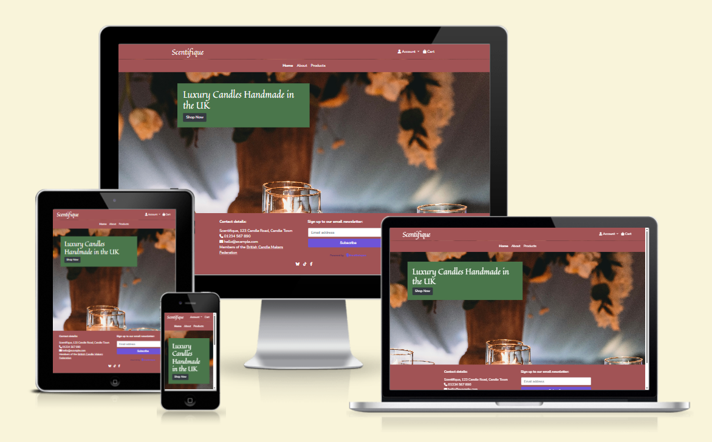

## Table of Contents

- [User Experience Design](#user-experience-design)
- [Data Model](#data-model)
- [Technologies Used](#technologies-used)
- [Features](#features)
- [Project Management](#project-management)
- [Testing](#testing)
- [Deployment](#deployment)
- [Marketing Strategy](#marketing-strategy)
- [Credits](#credits)

## User Experience Design

I created the site's high-level design using the "five planes" method.

### Strategy Plane

The strategy plane is where we begin to understand what the business owner wants from the website and what its users will want.

#### Business Owner Goals

- Primary goal
  - To increase revenue and profit, so the business owner makes more money.
  - To increase revenue and profit, so Scentifique's employees have more secure jobs.
  - To increase the number of customers, so more people can enjoy the company's products.

- Supporting goals
  - To spread awareness of the business beyond the local area, so that more people enter the top of the sales funnel.
  - To enable people from across the UK to buy Scentifique's products online, as that's much more convenient than having to visit a craft fair, which should improve the visitor to customer conversion rate.
  - To publish blog posts about scented candles, so that people who are searching online for information about scented candles can easily find the business.
  - To send a regular e-newsletter to potential customers, so the business remains top of mind with customers and leads.
  - To maintain the company's arts & crafts style, as this has proven to be popular with existing customers.

#### User Primary Goals

- Primary goals
  - To enjoy the beauty and fragrance of luxury candles.
  - To give luxury scented candles as a gift.

- Supporting goals
  - To buy candles online, so they don’t have to go to a shop.
  - To learn about candles, so they know how the different waxes burn, which fragrances work together, etc.
  - To be able to select a candle's style, colour and fragrance, so their candles are bespoke and not just another off-the-shelf product.
  - To be part of a community of luxury scented candle lovers.

### Scope Plane

The scope plane is where we decide what functionality is within scope and what falls outside the scope of the project.

#### Epics

For the initial version of the site, there were three epics (high-level requirements):

- Epic: An attractive, trustworthy website
  - As a user, I can see a website that builds my confidence and trust in the company, so I feel safe enough to make an online purchase through the site.

-  Epic: E-commerce capabilities
  - As a user, I can select and purchase candles through the website, so I don't have to visit a craft fair to buy candles from Scentifique.

- Epic: E-newsletter
  - As a user, I can read and subscribe to blog posts covering various candle-related topics, so I can become more knowledgeable about candles and stay up to date with the latest trends and offers.

Given the length of the project's overall timebox, I thought one-week sprints would work well. The above epics seemed to be too large to fit within a single one-week sprint, so I broke them down into user stories, listed below.

#### User Stories

Note that the user stories are prioritised using the MoSCoW system of must-have, should-have and could-have.

Also, the user story numbers are taken from the related [GitHub Project](https://github.com/users/John-Kingham/projects/15).

- Epic 1: An attractive, trustworthy website
  - #1 (must-have): As a User, I can see a website that looks good and works well on all screen sizes, so I’m not put off by a poor user experience.
  - #2 (must-have): As a User, I can see useful information about the company, so I can decide if it’s trustworthy enough to buy from.
  - #13 (must-have): As a User, I can easily find the website through a search engine, so I can visit the site and buy its products.

- Epic 2: E-commerce capabilities
  - #4 (must-have): As a User, I can see a list of products on the site, so I can choose products to buy.
  - #6 (must-have): As a User, I have a “basket” where I can add or remove multiple items, so I can purchase multiple items in one transaction.
  - #7 (must-have): As a User, I can purchase items in my “basket” using a credit/debit card, so I don’t have to send a cheque or cash.
  - #3 (must-have): As a User, I can see helpful feedback on each important action I take on the site, so that I always know whether my actions were successful or not.
  - #8 (must-have): As a Logged-in User, I can save my address, so I don’t have to enter it manually for future orders.
  - #9 (should-have): As a Logged-in User, I can see my previous orders, so I know how much I’ve spent.
  - #10 (could-have): As a User, I can sort and filter products on the website by price, size and other factors, so I can easily find the products I’m looking for.
  - #5 (must-have): As an Admin, I can create, update and delete product information through a well-designed front-end, so I don’t have to switch back and forth between the site's front-end and admin area.

- Epic 3: E-newsletter
  - #11 (must-have): As a User, I can sign-up to a regular email newsletter, so I can find out more about candlemaking and the latest candles and offers.
  - #12 (could-have): As a User, I can read blog posts about candles, so I can learn more about candles and how to get the best out of them.

### Structure Plane

In the structure plane, we begin to outline the solution at a high level. The diagram below shows how the site's interface is structured into pages and sections.

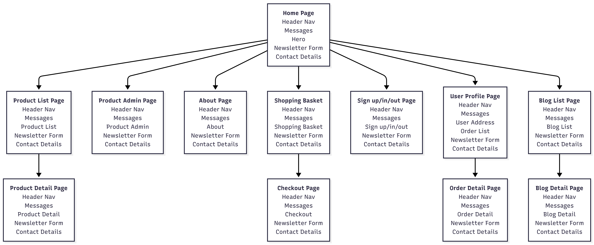

Each section helps to fulfil one or more user stories, and the relationship between webpage sections and user stories is explained in the Features section below.

At this stage, I also started to think about the structure of the database, and this is detailed in the Data Model section below.

Note: The Order Detail, Blog List and Blog Details pages didn't make it into the current site and have been deferred to future sprints.

### Skeleton Plane

In the skeleton plane, we add detail to the structure developed in the structure plane.

In this case, I used wireframes to add further detail to each web page. These wireframes were for general guidance purposes only and the site's actual design has minor differences from the wireframes.

#### Mobile Wireframes

Mobile wireframes

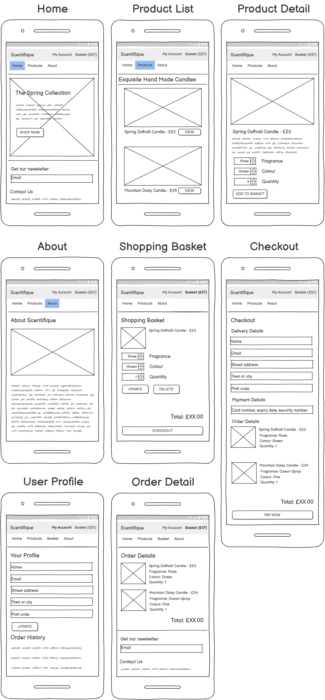

#### Tablet Wireframes

Tablet wireframes

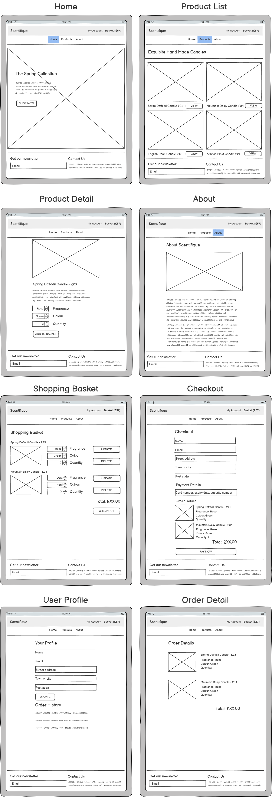

#### Desktop Wireframes

Desktop wireframes

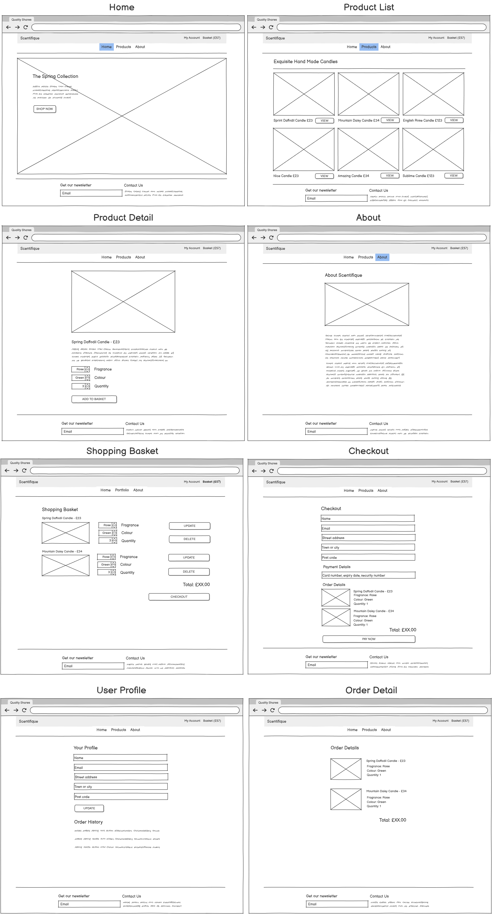

### Surface Plane

This is the final plane, where we add colour and other fine details to our bare wireframes.

#### Colour Palette

The site uses two primary colours, inspired by the Arts & Crafts wallpapers of William Morris, examples of which are available at sites like [Wall Passion](https://www.wallpassion.co.uk/william-morris).

- Red - #A15355
- Green - #4A764B

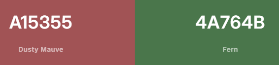

The site uses black for most text and white for some backgrounds. It also uses [Bootstrap](https://getbootstrap.com/) default colours for buttons and various feedback messages.

#### Custom Fonts

The site uses two custom fonts from Google Fonts.

- Headings - [Quintessential](https://fonts.google.com/specimen/Quintessential)
- Body - [Nunito](https://fonts.google.com/specimen/Nunito)

#### Content

All text content was generated by me, either alone or working with [Microsoft Co-Pilot](https://copilot.microsoft.com/).

## Data Model

To fulfil the project's requirements, the site has a database.

### Entity Relationship Diagram

During the structure and skeleton planes, I sketched out the following entity relationship diagram.

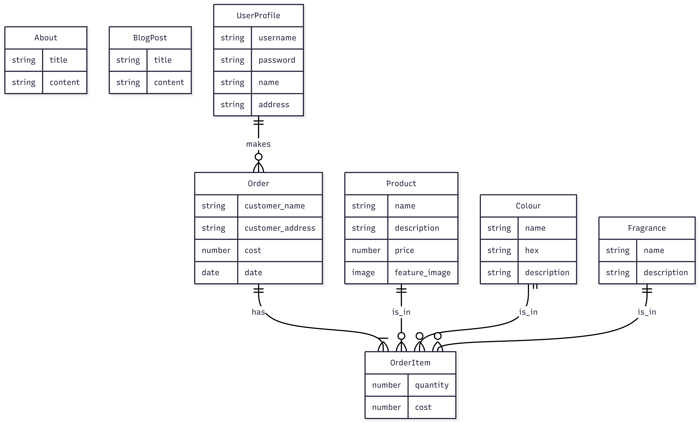

At this stage, the fields are simplified and use generic types such as `number` or `string`. The exact fields and field types were decided during the iterative development phase and are detailed below.

### Implemented Database Schema

Note: The BlogPost table didn't make it into the final design, as the blog functionality was deferred until a future sprint.

#### about.About Model

|Field|Type|Attributes|
|---|---|---|
|title|CharField|max_length=200, unique=True|
|content|TextField|blank=True|
|updated|DateTimeField|auto_now=True|

#### checkout.Order Model

|Field|Type|Attributes|
|---|---|---|
|order_number|CharField|max_length=32, null=False, editable=False|
|user_profile|ForeignKey|to=UserProfile, on_delete=models.SET_NULL, null=True, blank=True, related_name="orders"|
|full_name|CharField|max_length=50, null=False, blank=False|
| email | EmailField | max_length=254, null=False, blank=False |
| phone_number | CharField | max_length=20, null=False, blank=False |
| country | CountryField | blank_label="Country *", null=False, blank=False |
| postcode | CharField | max_length=20, null=True, blank=True |
| town_or_city | CharField | max_length=40, null=False, blank=False |
| street_address1 | CharField | max_length=80, null=False, blank=False |
| street_address2 | CharField | max_length=80, null=True, blank=True |
| county | CharField | max_length=80, null=True, blank=True |
| date | DateTimeField | auto_now_add=True |
| delivery | DecimalField | max_digits=6, decimal_places=2, null=False, default=0 |
| lineitems_total | DecimalField | max_digits=10, decimal_places=2, null=False, default=0 |
| grand_total | DecimalField | max_digits=10, decimal_places=2, null=False, default=0 |
| original_cart | TextField | null=False, blank=False, default="" |
| stripe_pi_id | CharField | max_length=254, null=False, blank=False, default="" |

#### checkout.OrderLineItem Model

|Field|Type|Attributes|
|---|---|---|
| order | ForeignKey | to=Order, null=False, blank=False, on_delete=CASCADE, related_name="lineitems" |
| product | ForeignKey | to=Product, null=False, blank=False, on_delete=CASCADE |
| colour | ForeignKey | to=Colour, null=False, blank=False, on_delete=CASCADE |
| fragrance | ForeignKey | to=Fragrance, null=False, blank=False, on_delete=CASCADE |
| quantity | IntegerField | null=False, blank=False, default=0 |
| total | DecimalField | max_digits=6, decimal_places=2, null=False, blank=False, editable=False |

#### products.Colour Model

|Field|Type|Attributes|
|---|---|---|
| name | CharField | max_length=254 |
| hex | CharField | max_length=10 |
| description | TextField | None |

#### products.Fragrance Model

|Field|Type|Attributes|
|---|---|---|
| name | CharField | max_length=254 |
| description | TextField | None |

#### products.Product Model

|Field|Type|Attributes|
|---|---|---|
| name | CharField | max_length=254 |
| description | TextField | None |
| price | DecimalField | max_digits=6, decimal_places=2 |
| image_url | URLField | max_length=1024, null=True, blank=True |
| image | ImageField | null=True, blank=True |

#### profiles.UserProfile

|Field|Type|Attributes|
|---|---|---|
| user | OneToOneField | to=User, on_delete=CASCADE |
| default_phone_number | CharField | max_length=20, null=True, blank=True |
| default_street_address1 | CharField | max_length=80, null=True, blank=True |
| default_street_address2 | CharField | max_length=80, null=True, blank=True |
| default_town_or_city | CharField | max_length=40, null=True, blank=True |
| default_county | CharField | max_length=80, null=True, blank=True |
| default_postcode | CharField | max_length=20, null=True, blank=True |
| default_country | CountryField | blank_label="Country", null=True, blank=True |

## Technologies Used

### Languages

- [CSS](https://developer.mozilla.org/en-US/docs/Web/CSS)
- [HTML](https://developer.mozilla.org/en-US/docs/Web/HTML)
- [JavaScript](https://developer.mozilla.org/en-US/docs/Web/JavaScript)
- [Python](https://www.python.org/)

### Frameworks & Libraries

- [Bootstrap](https://getbootstrap.com/)
- [Django](https://www.djangoproject.com/)
- [JQuery](https://jquery.com/)

### Databases

- [SQLite3](https://sqlite.org/) - Django's default database, used for development
- [PostgreSQL](https://www.postgresql.org/) - Supplied by Code Institute for the deployed site

### External Storage

- [AWS S3](https://aws.amazon.com/)

### Hosting

- [Heroku](https://www.heroku.com/)

### Email

- [Gmail](https://mail.google.com/)

### Installed Python Libraries

- [boto3](https://pypi.org/project/boto3/)
- [django](https://pypi.org/project/Django/)
- [django-allauth](https://pypi.org/project/django-allauth/)
- [django-countries](https://pypi.org/project/django-countries/)
- [django-crispy-forms](https://pypi.org/project/django-crispy-forms/)
- [django-storages](https://pypi.org/project/django-storages/)
- [django-summernote](https://pypi.org/project/django-summernote/)
- [dj_database_url](https://pypi.org/project/dj-database-url/)
- [flake8](https://pypi.org/project/flake8/)
- [gunicorn](https://pypi.org/project/gunicorn/)
- [pillow](https://pypi.org/project/pillow/)
- [psycopg2](https://pypi.org/project/psycopg2/)
- [setuptools](https://pypi.org/project/setuptools/)
- [stripe](https://pypi.org/project/stripe/)
- Required dependencies of the above libraries

## Features

### Implemented Features

#### Header Navigation

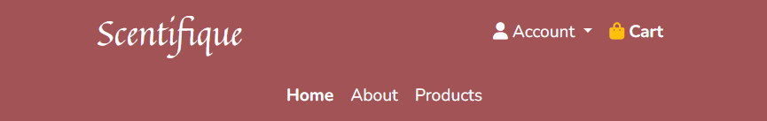

- Each page contains a header navigation section.
- This section contains the site's title in the custom headings font. All text in this section is white by default and light grey on hover.
- This section also contains an Account drop-down. Clicking reveals a drop-down menu with options to sign up or sign in. The drop-down menu has a white background with black text. The menu item background colour changes on hover to provide visual feedback. When a user is logged in, the menu items are user-profile and sign-out and the Account icon turns gold. When an admin is logged in, the menu includes an add-product item.
- This section also contains a link to the user's shopping cart. When the cart isn't empty the icon turns gold.
- This section also contains a navigation bar, with links to the site's top-level pages (Home, About, Products). These links are bold when the user is on the related page.
- This section is useful to users for several reasons. It provides a consistent look-and-feel at the start of each page, it enables users to sign in and out, it lets users know if they're logged in or if they have items in their cart, and it helps users navigate around the site.

#### Messages

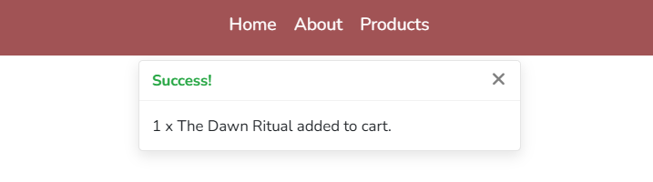

- This section displays messages to users, providing additional feedback for certain activities. These include signing in and out, and updating the cart by adding or removing items.

#### Homepage Hero

- This section contains an image of some luxury candles, a brief description of what the site offers and a link to the products page.
- The text-box background uses the site's custom green colour and text is in white, using the site's custom headings font.
- The button has white text and uses Bootstrap's default `btn-dark` colour, which changes its shade on hover to provide visual feedback.
- This section is useful to users because it helps them quickly understand what the site is about and what it offers, so they can decide whether to continue browsing the site or exit. It also provides a clear link to the e-commerce part of the site, which could improve revenues.

#### Contact Details

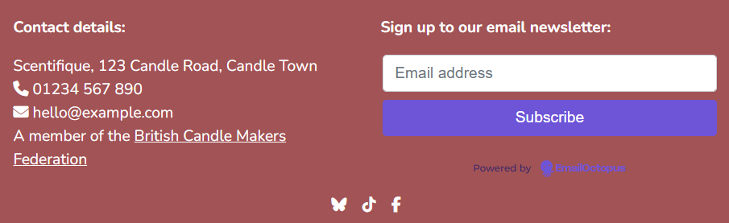

- The footer of each page contains the company's contact details.
- The footer uses the custom red colour for its background and all text is in white (except some text in the newsletter form which it outside our control).
- Contact details include the company's postal address, phone number, email and main social media links.
- Each social media icon links to its respective social media platform.
- This section is useful to users because it enables them to contact the company in various ways.

#### Newsletter Form

- The footer contains a newsletter sign-up form. See the Contact Details section above for an image of the newsletter sign-up form.
- Styling for this form was mostly out of my control, as the form is copied directly from code supplied by [Email Octopus](https://emailoctopus.com/), a UK-based alternative to MailChimp.
- This section is useful to users as it allows them to subscribe to Scentifique's regular e-newsletter, which contains educational and entertaining updates, as well as event-based offers (e.g. Mothers Day).

#### Product List

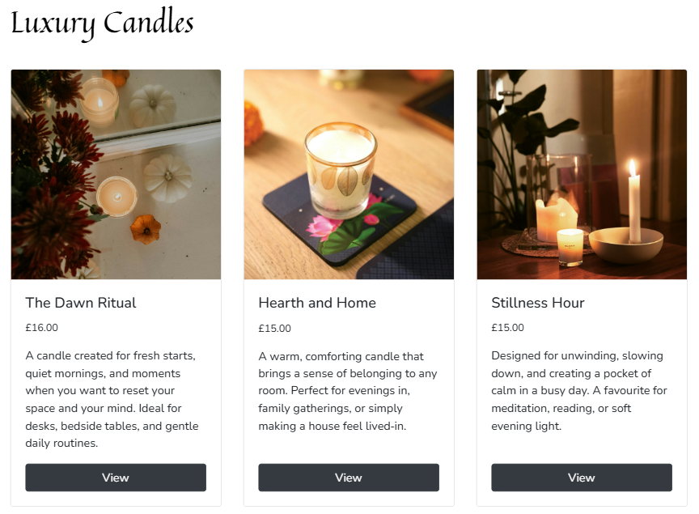

- The product page contains a page heading and a list of all products.
- This section's headings use the site's custom heading font and are in black.
- Individual products are shown in a "card" format, with each card containing the product's image, title, price, description and a button to view the product details page.
- This section lacks pagination, but the site currently has relatively few products so this isn't a major issue. Pagination can easily be added in a future release.
- This section is useful to users as it allows them to quickly scan through all products on the site, so they can quickly learn more about and (hopefully) purchase their perfect candle.

#### Product Detail

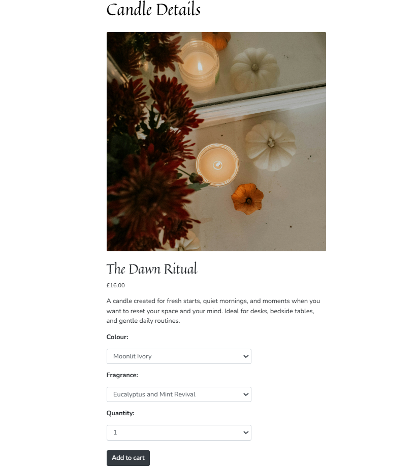

- This section has a page title and shows the product's image, name, price and description.
- The page title and product name use the site's custom heading font.
- This section also contains select elements where users can choose the colour, fragrance and quantity for their product.
- The page also contains an add-to-cart button, where users can add their chosen product to their shopping cart.
- Logged-in admins can also see edit-product and delete buttons, for editing or deleting products.
- This section is useful to users because it's where they'll find detailed information about each product, and where they can customise their handmade candles and add them to their cart. It's also useful to admins as it allows them to edit or delete products from the front end.

#### Add Product

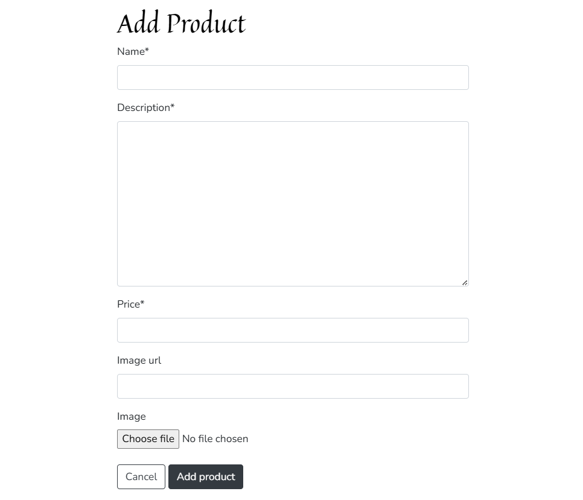

- Logged-in admins can use the Account drop-down in the site header to navigate to an add-product page. 
- This section has a page title and a form where admins can submit details for a new product.
- The page title is in black and uses the site's custom heading font.
- The form mostly uses Bootstrap's default styling for forms.
- The form has two buttons. The cancel button uses Bootstrap's default `btn-outline-dark` style, while the add-product button uses Bootstrap's default `btn-dark` style. Both buttons change their shade on hover.
- This section is useful to admins because it allows them to add new products from the front end, so they don't have to navigate to the admin dashboard to add new products.

#### Edit Product

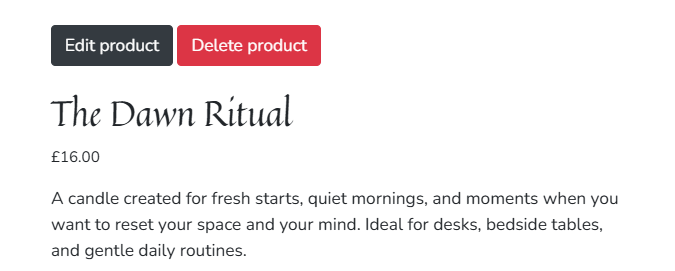

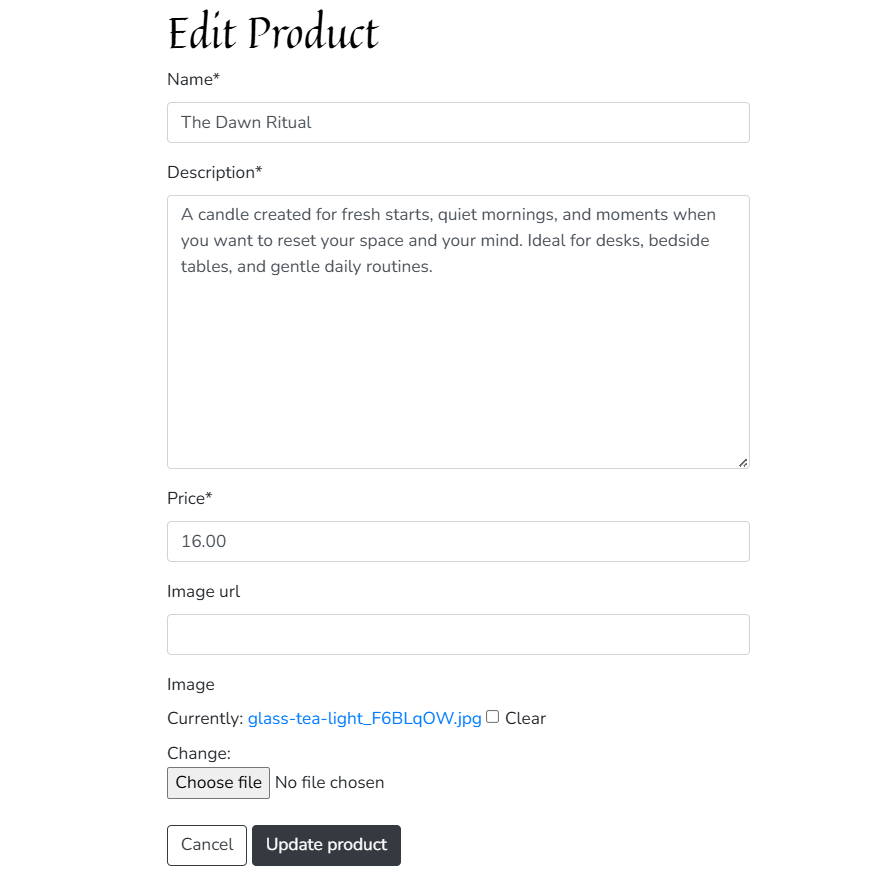

- Logged-in admins can see edit-product and delete-product buttons on the Product Detail page. The edit-product button links to the Edit Product page. The delete-product button immediately deletes the product and returns the user to the products page.
- This section has a page title and a form where admins can edit details for an existing product.
- The page title is in black and uses the site's custom heading font.
- The form mostly uses Bootstrap's default styling for forms.
- The form has two buttons. The cancel button uses Bootstrap's default `btn-outline-dark` style, while the update-product button uses Bootstrap's default `btn-dark` style. Both buttons change their shade on hover.
- This section is useful to admins because it allows them to edit existing products from the front end, so they can do it without having to navigate to the admin dashboard.

#### About

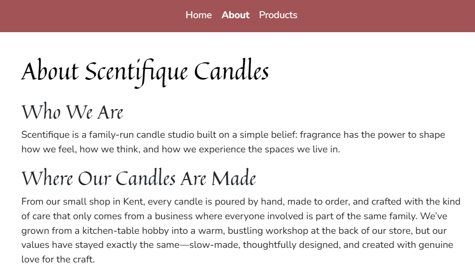

- This section contains information about Scentifique.
- It includes a title (using the site-wide custom heading) and relevant written content.
- The content uses the site's custom body font for body text and the custom heading font for headings.
- This section is useful to users as they can learn more about the company behind the site and how it makes its candles, which will help build their trust in the company and its products, and (hopefully) make them more likely to purchase products from the store.

#### Shopping Basket

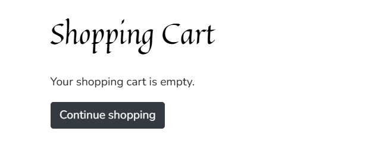

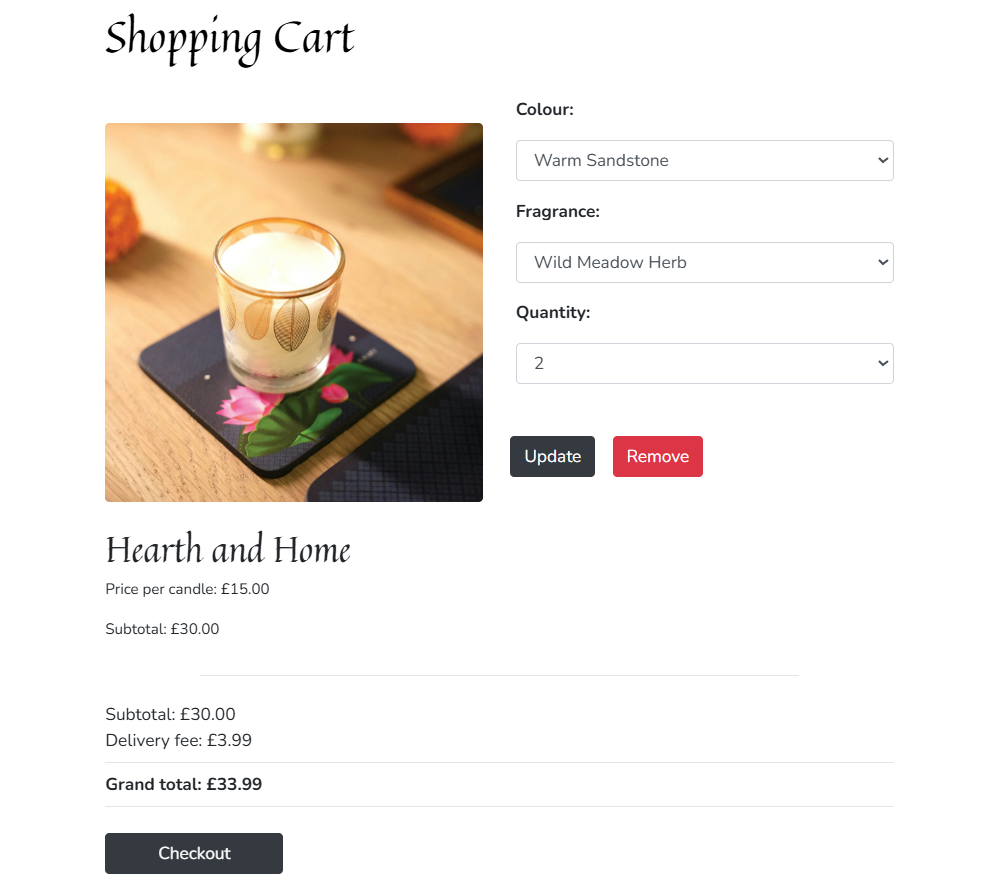

- This section is where users can find a list of items in their cart, as well as subtotals, delivery fees, a grand total and a checkout button.
- The page header uses the site's custom heading font.
- When the cart is empty, this section displays a message telling users their cart is empty, along with a continue-shopping button which links back to the product page. The button uses Bootstrap's `btn-dark` style.
- When the cart contains products, each product is listed separately. For each product in the cart, the name, image and price are shown, along with the customer's chosen colour, fragrance and quantity.
- The colour, fragrance and quantity are editable select elements, so users can update their cart if they want.
- Each product also has update and remove buttons, which users can click to either update the item (to save changes to the colour, fragrance or quantity) or to delete it. The update button uses Bootstrap's `btn-dark` style and the remove button uses Bootstrap's `btn-danger` style.
- Below the list of products, users can see a subtotal for all items, the delivery fee and a grand total. The grand total is bolded and horizontal lines are used to separate it from other figures.
- Below the grand total there is a checkout button, which uses Bootstrap's `btn-dark` style. This button takes users to the checkout page.
- This section is useful for users because it allows them to see all of the items in their cart, and to update or remove them. Users can also see the total cost of their cart along with the delivery fee. Users can also navigate to the checkout page, where they'll be able to purchase the items in their cart.

#### Checkout

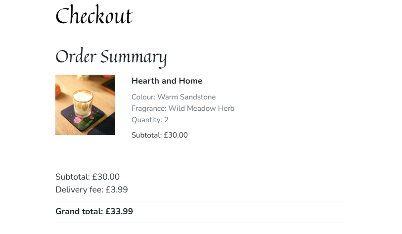

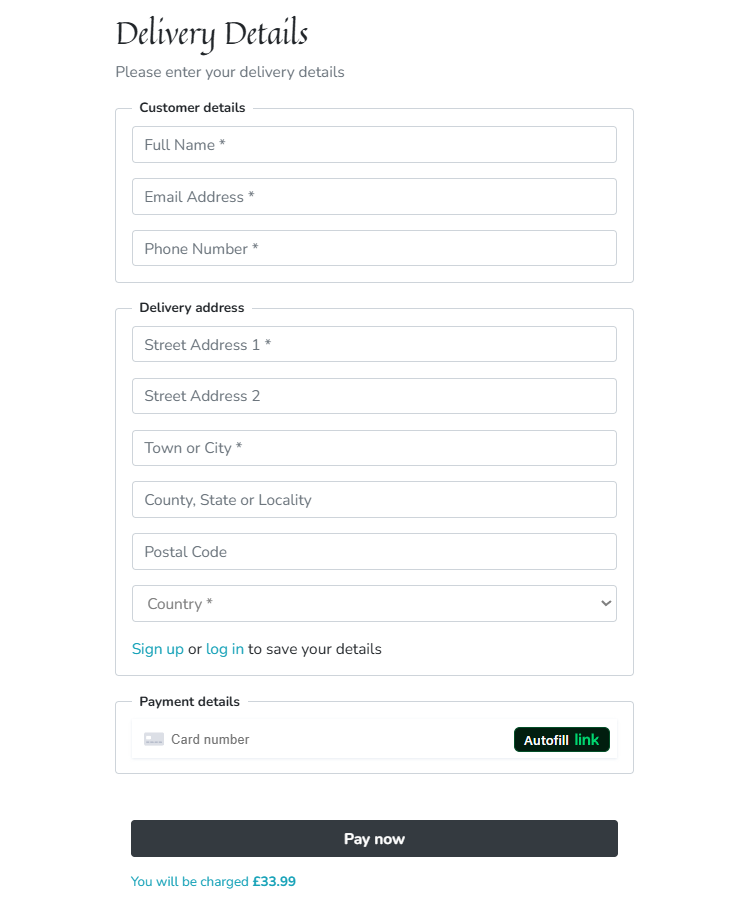

- This section contains a page title, a summary of the order, a form for entering customer details, delivery details and payment details, an option to save user details and a pay-now button.
- The page title uses the site's custom heading font.
- The order summary section has a heading and shows the image, product name, colour, fragrance, quantity and subtotal of each item in the cart. It also shows an overall subtotal, the delivery fee and the cart's grand total.
- The delivery details section has a heading and has separate subsections for customer details, delivery address details and payment details. Each of these sections has a border with a subtitle. Each form field has a placeholder with the field's name and an asterisk if the field is mandatory.
- The payment details section includes a Stripe form. This form uses Stripe's default style as much as possible, to leverage user's familiarity with Stripe payment forms used on other sites. The payment details form includes all relevant payment card validation.
- The pay-now button uses Bootstrap's `btn-dark` style to remain consistent with the rest of the site. Below the pay-now button is a message, notifying users of the amount that will be charged to their card.
- This section is useful to users as it allows them to purchase Scentifique's handmade candles online, so they don't have to visit a craft fair in person.

Note: The site is currently connected to a test Stripe account, so payments cannot be taken from real cards.

##### Checkout Order Confirmation

- This page is shown after the user has successfully completed an order. It shows all of the order's details, including order number and date, the items ordered and the delivery and billing details.
- Headings use the site's custom headings font.
- Bold is used to emphasise some field names or important values such as the grand total.
- The page also contains a continue shopping button, which uses Bootstrap's default `btn-dark` style.
- This section is useful to users as it confirms that their order has been successfully processed.

#### Sign Up

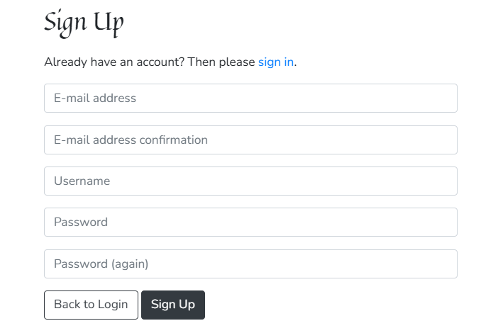

- This section enables users to sign up so they can save their delivery details and (when it's delivered in a future release) view their order history. Users can reach this section by clicking on the sign-in menu item in the site header's Account drop-down.
- This section contains a heading which uses the site-wide custom heading font, a sign-up form and back-to-login and sign-up button.
- The form has fields for email, username and password and each field has built-in validation rules from AllAuth.
- The form's sign-up button uses Bootstrap's `btn-dark` colour and the back-to-login button uses `btn-outline-dark`. Both buttons change their shade on hover to provide visual feedback.
- This section is useful to users because it enables them to sign-up to save their delivery details. Additional functionality could be added in a future release, such as the ability to view previous orders.

#### Sign In

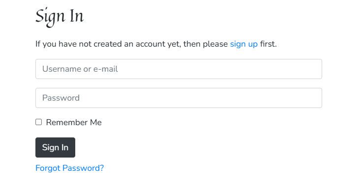

- This section is where signed-up users can sign-in to view and update their delivery details and have their delivery details auto-filled into the checkout form. Users can reach this section by clicking on the sign-up menu item in the site header's Account drop-down.
- This section contains a heading which uses the site-wide custom heading font and a sign-up form and button.
- The form has fields for email/username and password.
- The form's sign-in button uses Bootstrap's `btn-dark` colour and it changes shade on hover to provide visual feedback.
- This section is useful to users because it enables them to sign-in to view and update their delivery details, and to have their details auto-filled into the checkout form.

#### Sign Out

- This section is where signed-in users can sign-out to exit the site and keep their account secure. Signed-in users can reach this section by clicking on the sign-out menu item in the site header's Account drop-down (only visible to signed-in users).
- This section contains a heading which uses the site's custom heading font and cancel and sign-out buttons.
- The sign-out button uses Bootstrap's `btn-dark` colour and the cancel button uses `btn-outline-dark`. Both buttons change shade on hover to provide visual feedback.
- This section is useful to signed-in users because it enables them to sign out, which helps to keep their user profile secure.

#### User Profile

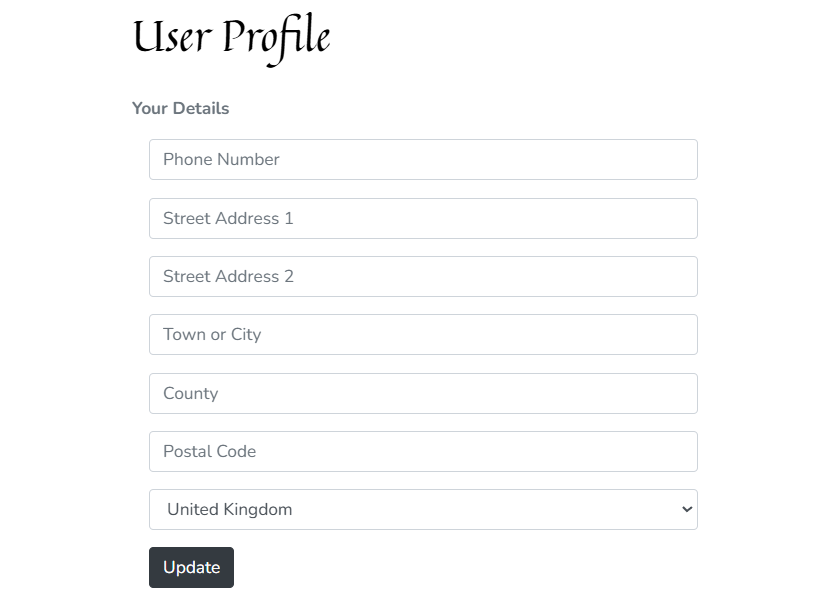

- This section enables signed-in users to save and update their delivery details and (when it's delivered in a future release) view their order history. Users can reach this section by clicking on the user-profile menu item in the site header's Account drop-down (only visible to signed-in users).
- This section contains a heading which uses the site's custom heading font, a user profile form and an update button.
- The form has fields for phone number, street address 1, street address 2, town or city, county, postal code and country.
- The country field uses a drop-down that restricts entry to valid countries.
- The form's button uses Bootstrap's `btn-dark` colour and it changes shade on hover to provide visual feedback.
- This section is useful to signed-in users as it enables them to save their delivery details, which will then be auto-populated into the checkout form when the user is logged in. Additional functionality could be added in a future release, such as the ability to view previous orders.

#### 404 Error

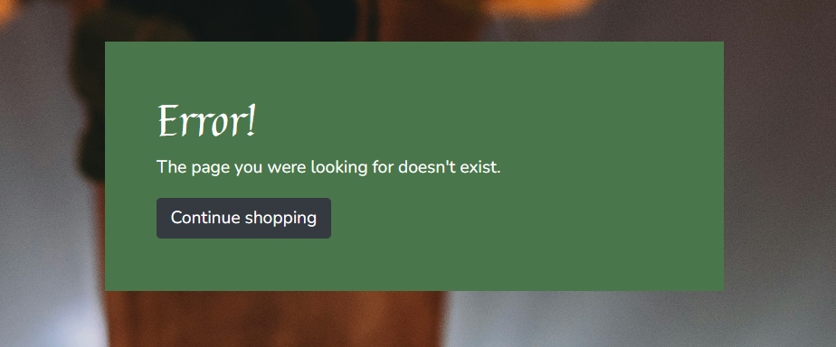

- The 404 error section is shown if the user enters an invalid URL.
- This section contains a simple error message and a continue-shopping button to return to the products page.
- This section is useful to users because it tells them when they've visited an invalid URL, and gives them an easy way to get back to the products page.

### Future Features

Due to time constraints, some of the should-have and could-have user stories were left out of the current release. These items could easily be included in future sprints and releases.

- User story #9: View order history
- User story #10: Sort and filter products
- User story #12: Read blog posts

In addition, there are many other features that could be added to future versions of the site. These include pagination on the products page, product categories and discount coupons. 

## Project Management

I used Scrum to manage the iterative development phase. You can see the full details of each user story in the related [GitHub Project](https://github.com/users/John-Kingham/projects/15).

In a nutshell, I broke the project down into sprints that were approximately 1 week in length. I say "approximately" because the development time had to be fitted around other personal commitments.

### Sprint 1

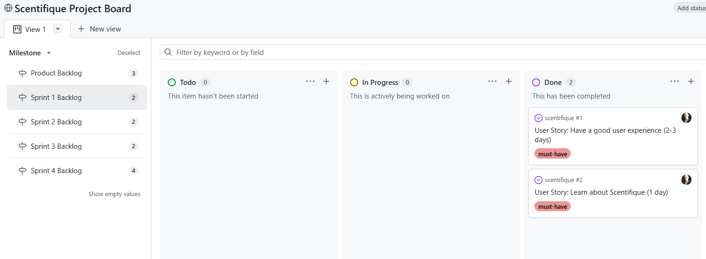

#### Sprint Goal

Create the Home and About pages.

#### User Stories

- #1 Have a good user experience (must-have)
- #2 Learn about Scentifique (must-have)

### Sprint 2

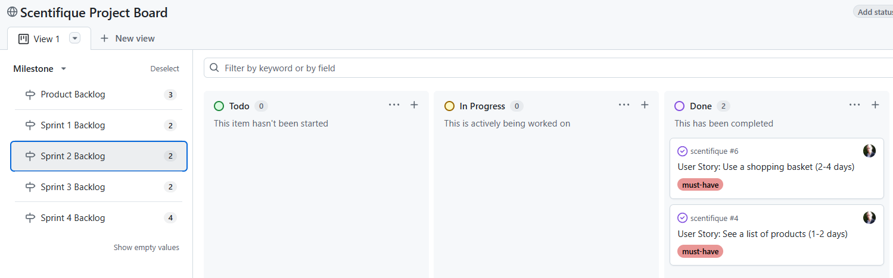

#### Sprint Goal

Add products and shopping basket.

#### User Stories

- #4 See a list of products (must-have)
- #6 Use a shopping basket (must-have)

### Sprint 3

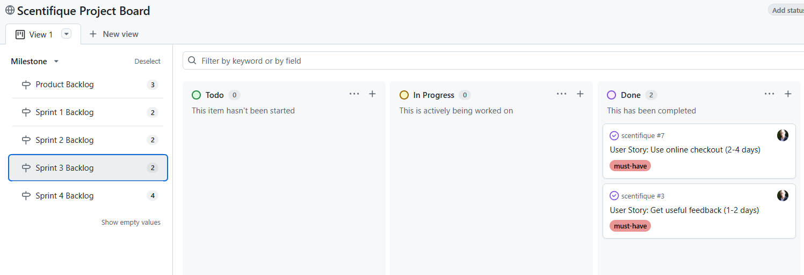

#### Sprint Goal

Add feedback messages and a checkout.

#### User Stories

- #3 Get useful feedback (must-have)
- #7 Use online checkout (must-have)

### Sprint 4

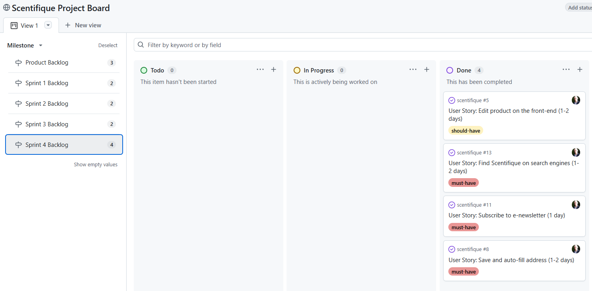

#### Sprint Goal

Add marketing features, allow users to save their address and admins to CRUD products from the front end.

#### User Stories

- #5 Edit products on the front-end (should-have)
- #8 Save and auto-fill address (must-have)
- #11 Subscribe to e-newsletter (must-have)
- #13 Find Scentifique on search engines (must-have)

### Product Backlog

By the project deadline, there were several could-have and should-have user stories still in the product backlog. This is a normal and expected part of agile software development.

##### Unfinished User Stories in the Product Backlog

- #9: View order history
- #10: Sort and filter products
- #12: Read blog posts

## Testing

The website was thoroughly tested, with all tests documented in [TESTING.md](./docs/TESTING.md).

## Deployment

This repository can be cloned to make a copy on your local machine or forked to make a copy in your GitHub account.

### Cloning

You can clone the repository using these steps:

1. Go to the [GitHub repository](https://github.com/John-Kingham/scentifique).
2. Click on the green Code button near the top.
3. Select whether to clone using HTTPS, SSH, or GitHub CLI, and copy the URL to your clipboard.
4. On your local machine, open your terminal (or Git Bash, depending on your operating system).
5. Change the current working directory to the location where you want the cloned directory.
6. In your terminal, type the following command to clone the repository:
	- `git clone https://github.com/John-Kingham/scentifique`
7. Press Enter to create your local clone.

### Forking

By forking the GitHub repository, you can make a copy of the original repository on your GitHub account to view and/or make changes without affecting the original repository. You can fork this repository using the following steps:

1. Log in to GitHub and go to the [GitHub repository](https://github.com/John-Kingham/scentifique).
2. Find the Fork button at the top of the page and click it.
3. You should now have a copy of the repository in your own GitHub account.

### Database

The local site uses Django's default sqlite3 database. The deployed site uses a PostgreSQL database.

Creating a PostgreSQL database is beyond the scope of this document. Please refer to the [PostgreSQL documentation](https://www.postgresql.org/docs/) for more information on creating and managing a PostgreSQL database.

### Media and Static File Hosting

The local version of this site stores media and static files locally. The deployed site uses [Amazon Web Services (AWS)](https://aws.amazon.com/) to store media and static files.

Creating and setting up AWS is beyond the scope of this document. Please refer to the official [AWS documentation](https://docs.aws.amazon.com/?nc2=h_rsc_lrn_docs) for more information on creating and setting up an AWS account.

### Stripe

The local and deployed versions of the site use Stripe for payment processing.

Creating and setting up a Stripe account is beyond the scope of this document. Please refer to the official [Stripe documentation](https://docs.stripe.com/) for more information on creating and setting up a Stripe account.

### Site Hosting

The site has been deployed using [Heroku](https://www.heroku.com/). The deployment instructions below assume you have a suitable Heroku account.

### Local Deployment

To run the site locally, follow the steps below:

1. Clone the remote repository to your local machine using the instructions above.
1. Start a Python virtual environment of your choice (to avoid loading required libraries into your global environment).
1. Run `pip install -r requirements.txt` to install required libraries.
1. Create a file in the root directory called `env.py` (in the remote repository this file is in `.gitignore`, so it wasn't cloned to your local repository).
1. In `env.py`, set the following environment variable defaults:
    - `DEVELOPMENT` - Set it any non-blank value. This puts only the development environment into debug mode.
    - `SECRET_KEY` - Set it to be a suitably secure secret key.
    - `STRIPE_PUBLIC_KEY` - In your Stripe account, go to the Developers/API Keys page and copy/paste your publishable key.
    - `STRIPE_SECRET_KEY` - In your Stripe account, go to the Developers/API Keys page and copy/paste your secret key.
    - `STRIPE_WH_SECRET` - Create this secret key using the local Stripe CLI (which you'll need to install).
      - Run the site's server locally using `py manage.py runserver`.
      - In a second terminal, run `stripe listen --forward-to localhost:8000/checkout/webhook/`. Stripe will give you a secret key which you should copy into the environment variable.
1. Run `python manage.py migrate` to create built-in and site-specific database tables.
1. Run `python manage.py createsuperuser` to create an admin account. Admins can log into the site using the `/admin/` path.
1. Run `python manage.py collectstatic`. This copies static files into a directory called `staticfiles` which enables static files to be loaded correctly when running the site locally.
1. Run `python manage.py runserver` to launch the site locally using Django's built-in server.
1. Click the link in the terminal where it says `Starting development server at <your-local-url>` and the site should launch correctly.

### Deployment to Heroku

The production version of the site has been deployed using [Heroku](https://www.heroku.com/). To deploy a copy of the site to Heroku, follow these steps:

1. Fork or clone this repository using the instructions above.
1. If you cloned this repository, push your clone up to a remote repo on your GitHub account.
1. In your Heroku account, create a new app.
1. Assuming you're using AWS, PostgreSQL and AWS, add these config variables to your new app:
    - `AWS_ACCESS_KEY_ID` - This comes from the AWS credentials.csv file. Refer to the AWS documentation to create that file.
    - `AWS_SECRET_ACCESS_KEY` - This comes from the AWS credentials.csv file. Refer to the AWS documentation to create that file.
    - `DATABASE_URL` - This is the URL of your PostgreSQL database.
    - `SECRET_KEY` - A secure secret key, different to the one in `env.py`
    - `STRIPE_PUBLIC_KEY` - In your Stripe account, go to the Developers/API Keys page and copy/paste your publishable key.
    - `STRIPE_SECRET_KEY` - In your Stripe account, go to the Developers/API Keys page and copy/paste your secret key.
    - `STRIPE_WH_SECRET` - In your Stripe account, go to Developers / Webhooks and set up a destination. Please refer to the Stripe documentation for more details. The destination will have a webhook secret which you should copy in as the value for this variable.
    - `USE_AWS` - Set this to any non-blank value so the production environment uses AWS for media and static files.
    - `EMAIL_HOST_USER` - The email address used to send SMTP sign-up and purchase confirmation emails.
    - `EMAIL_HOST_PASS` - The SMTP email address's "app password". Instructions on setting up an email host to send emails is beyond the scope of this document. 
1. Add a buildpack for Python.
1. Connect the Heroku app to your GitHub repository.
1. Deploy the main branch in Heroku.
1. Wait for the site to deploy and then check that it has deployed correctly.

These steps require knowledge of Heroku that is beyond the scope of this document. If you need additional information to set up your Heroku deployment, read the official [Heroku documentation](https://devcenter.heroku.com/).

## Marketing Strategy

To maximise revenues and profits from this e-commerce website, Scentifique has a marketing strategy that involves a combination of social media marketing, search engine optimisation and conversion rate optimisation.

### Social Media Marketing

To maximise the number of ideal prospects entering the top of the sales funnel, Scentifique is looking to set up a Facebook page where it will post regular updates relating to luxury scented candles and handmade candles. These updates will have links to the e-commerce site, which will hopefully funnel lots of Facebook users to the site.

#### Mock-up of proposed Facebook page

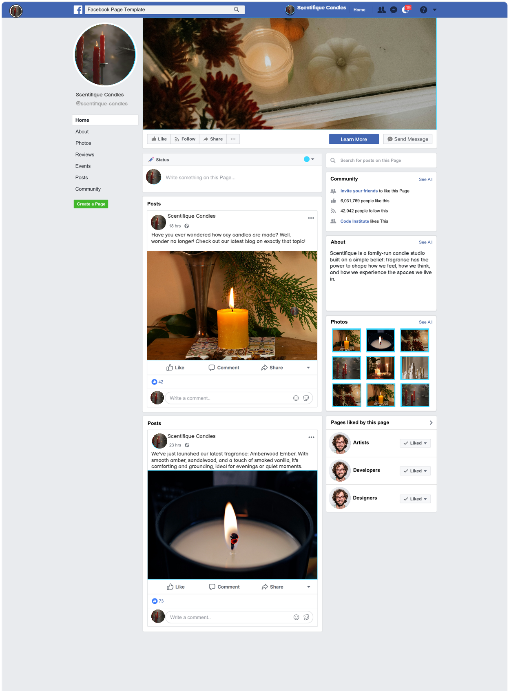

### Search Engine Optimisation

Search engines like Google and Ecosia are another important source of traffic and, more importantly, potential customers. 

#### Keywords

To rank well on search engines, sites need to contain a range of keywords that target the top, middle and bottom of the sales funnel.

After some initial brainstorming and research, I came up with an initial list of potential keywords:

- Short‑Tail (top of the funnel)
  - handmade candles
  - scented candles UK
  - soy wax candles
  - luxury candles
- Mid‑Tail (middle of the funnel)
  - relaxing scented candles
  - personalised candle gift
  - aromatherapy candles UK
- Long‑Tail (bottom of the funnel)
  - handmade candles for relaxation
  - eco‑friendly soy candle
  - custom colour and fragrance candle

Some of the short-tail keywords were included in the site's static content while some of the longer keywords were included in product descriptions.

The plan is that more longer-tail keywords will be embedded within future blog posts, as a blog is one of the most important features for the next phase of development. Blog posts are also an easy way to add dozens or hundreds of pages of content covering very specific bottom-of-funnel topics.

#### Sitemap and robot.txt files

The site also has sitemap.xml and robot.txt files, as these are important ways to manage a site's relationship with search engines.

### Conversion Rate Optimisation

Converting visitors into leads and leads into customers is one of the most cost-effective ways to grow e-commerce revenues and profits. To support this, the site has an e-newsletter embedded within the footer of each page.

The newsletter form comes from [Email Octopus](https://emailoctopus.com/), which is a UK-based alternative to MailChimp. You can see this form in the Features section above.

Leads will be sent regular email updates, with the aim being to nurture them into becoming new customers and, eventually, into being raving fans who promote the business to their friends and family. 

## Credits 

### Project Management

- I managed the design phase using the 5-Planes method, as detailed in [The Elements of User Experience](https://uk.bookshop.org/p/books/elements-of-user-experience-the-user-centered-design-for-the-web-and-beyond-jesse-james-garrett/e232e0c9869653bd?ean=9780321683687&next=t&next=t).
- I managed the construction phase using [Scrum](https://www.scrum.org/).

### Strategy Plane

- I used [Google Docs](https://docs.google.com/) to record business and user goals.

### Scope Plane

- I used [Google Docs](https://docs.google.com/) to record epics and [GitHub Projects](https://github.com/users/John-Kingham/projects/14) to record user stories and tasks.

### Structure Plane

- I used [Mermaid Chart](https://www.mermaidchart.com/) to create high-level structure diagrams for database tables and the user interface.

### Skeleton Plane

- I used [Mermaid Chart](https://www.mermaidchart.com/) to create detailed entity relationship diagrams for the database.
- I used [Balsamiq](https://balsamiq.com/) to create wireframes for the user interface.

### Surface Plane

#### Colour Palette

- I used Microsoft Paint to extract colours from images of William Morris wallpaper on [Wall Passion](https://www.wallpassion.co.uk/william-morris).
- I used the default [Bootstrap](https://getbootstrap.com/) colours for some elements, such as buttons and messages.

#### Content

- I used [Microsoft Co-Pilot](https://copilot.microsoft.com/) to generate data for the Product, Colour and Fragrance database tables, and for the About page.

#### Favicons

- I used [Gauger.io](https://gauger.io/fonticon/) to create a favicon image.
- I used [Favicon.io](https://favicon.io/) to convert the favicon into multiple favicon formats.

#### Fonts

- I used custom fonts from [Google Fonts](https://fonts.google.com/).

#### Icons

- I used [Font Awesome](https://fontawesome.com/) for social media, Account and Cart icons.

#### Images

- I used [UnSplash](https://unsplash.com/) for the site's static images and product images.

### Scrum Development Phase

- I used [Visual Studio Code](https://code.visualstudio.com/) as the development environment.
- I mostly used [Ecosia Search](https://www.ecosia.org/), [W3Schools](https://www.w3schools.com/), [Code Institute](https://codeinstitute.net/), [MDN](https://developer.mozilla.org/) and [Microsoft Copilot](https://copilot.microsoft.com/) for general research.
- I read parts of [The Epic Guide to Agile](https://www.davetodarobooks.com/) for additional information about Scrum.

### Documentation

- I used [Code Institute's README.md template](https://github.com/Code-Institute-Solutions/readme-template/blob/master/README.md) as the starting point for this document.
- I used [Am I Responsive](https://ui.dev/amiresponsive) to generate the multi-screen image at the start of this document.
- I used [Grammarly](https://www.grammarly.com/) to check spelling and grammar in README.md and TESTING.md.

## People

- I would like to thank my Code Institute mentor, [Simen Daehlin](https://github.com/Eventyret).
