# Scentifique - Manual Testing

## Functionality by Section

### Header Navigation

|Feature|Expect|Action|Result|Image|
|---|---|---|---|---|
|Site title|When clicked, the user is taken to the homepage|Clicked|As expected|None|
|Account menu|When the user is not logged in, the icon is white and the menu has sign-up and sign-in options|Viewed header when logged out|As expected|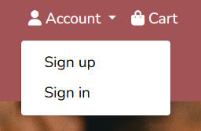|
|Account menu|When the user is logged in, the icon is gold, the text is bold and the menu has user-profile and sign-out options|Viewed header when logged in|As expected|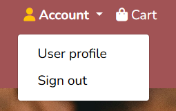|
|Sign-up menu item|When clicked, the user is taken to the sign-up page|Clicked|As expected|None|
|Sign-in menu item|When clicked, the user is taken to the sign-in page|Clicked|As expected|None|
|Sign-out menu-item|When clicked, the user is taken to the sign-out page|Clicked|As expected|None|
|Cart link|When the cart is empty, the icon is white|Viewed when cart was empty|As expected||
|Cart link|When the cart is not empty, the icon is gold and the text is bold|Viewed when cart was not empty|As expected||
|Home link|When clicked, the user is taken to the home page|Clicked|As expected|None|
|Home link|When the user is on the home page, the text is bold|Viewed from home page|As expected|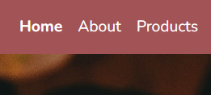|
|About link|When clicked, the user is taken to the About page|Clicked|As expected|None|
|About link|When the user is on the About page, the text is bold|Viewed from About page|As expected||
|Products link|When clicked, the user is taken to the Products page|Clicked|As expected|None|
|Products link|When the user is on the Products page, the text is bold|Viewed from Products page|As expected||

### Messages

Messages were testing during each of the relevant testing sections below.

### Homepage Hero

|Feature|Expect|Action|Result|Image|
|---|---|---|---|---|
|Shop now button|When clicked, the user is taken to the products page|Clicked|As expected|None|

### Contact Details

|Feature|Expect|Action|Result|Image|
|---|---|---|---|---|
|Social media icons|When clicked, the user is taken to the relevant social media platform|Clicked|As expected|None|

### Product List

|Feature|Expect|Action|Result|Image|
|---|---|---|---|---|
|Product image|When clicked, the user is taken to the product details page for that product|Clicked|As expected|None|
|View button|When clicked, the user is taken to the product details page for that product|Clicked|As expected|None|

### Product Detail

|Feature|Expect|Action|Result|Image|
|---|---|---|---|---|
|Colour, Fragrance and Quantity selectors|When clicked, the user is able to select a colour, fragrance or quantity|Clicked|As expected|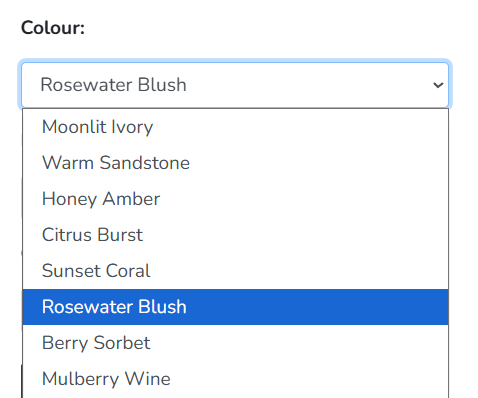|
|Add-to-cart button|When clicked, the product is added to the cart, the user remains on the product detail page and a success message is displayed|Clicked|As expected|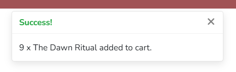|
|Merge items|If the add-to-cart button is clicked when the item matches an item already in the cart, the items are merged in the cart with their quantities combined (up to the maximum), the user remains on the product detail page and a success message is displayed|Clicked|As expected|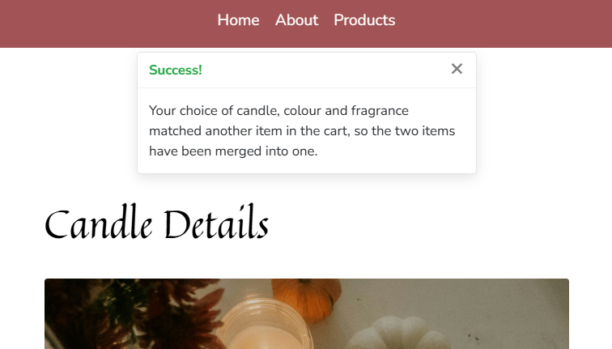|
|Edit-product button|When clicked by a logged-in admin, the admin is taken to the edit product page|Clicked|As expected|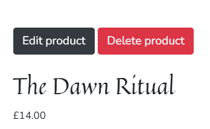|
|Delete button|When clicked by a logged-in admin, the product is deleted, the admin is taken to the products page and a success message is shown|Clicked|As expected|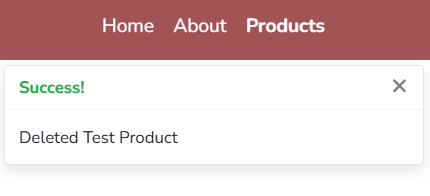|

### Add Product

|Feature|Expect|Action|Result|Image|
|---|---|---|---|---|
|Validation|If the form is submitted with blank mandatory fields, submission fails and a validation error is shown|Clicked|As expected|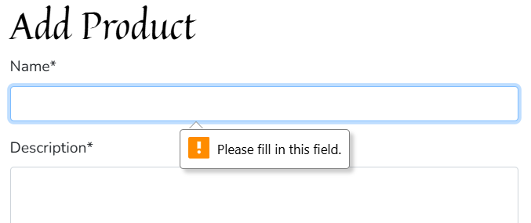|
|Add product button|If the form is submitted with valid data, a product is created, the admin is redirected to the product detail page for the new product, and a success message is shown|Clicked|As expected|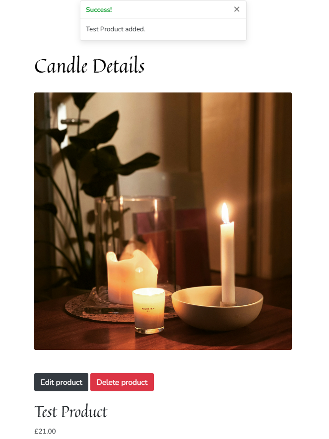|
|Authentication|If a logged in non-admin user visits the add product page, they are redirected to the home page and an error message is displayed|Clicked|As expected|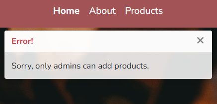|

### Edit Product

|Feature|Expect|Action|Result|Image|
|---|---|---|---|---|
|Validation|If the form is submitted with blank mandatory fields, submission fails and a validation error is shown|Clicked|As expected|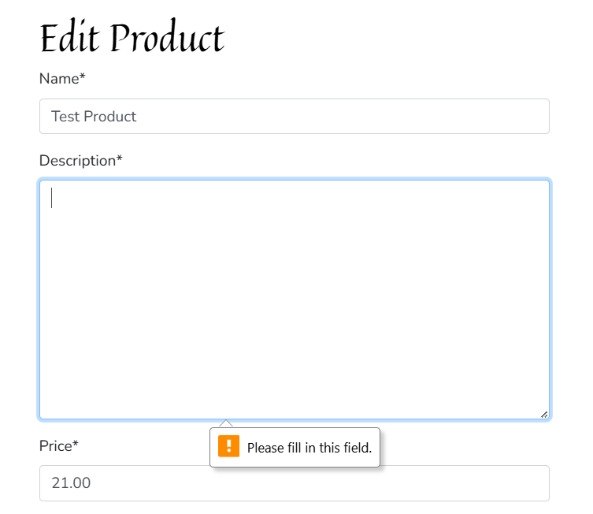|
|Update product button|If the form is submitted with valid data, the product is updated, the admin is redirected to the product's detail page and a success message is shown|Clicked|As expected|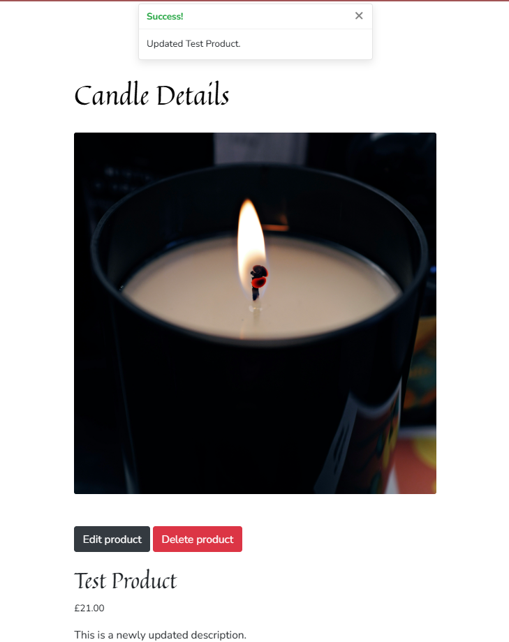|
|Authentication|If a logged in non-admin user visits the edit product page, they are redirected to the home page and an error message is displayed|Clicked|As expected|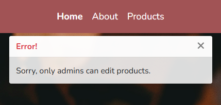|

### Shopping Basket

|Feature|Expect|Action|Result|Image|
|---|---|---|---|---|
|Empty cart|When the cart is empty, the user is informed and a continue shopping button is shown|Visited the shopping cart page when the cart was empty|As expected|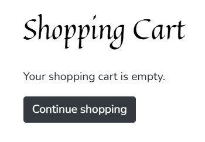|
|Non-empty cart|When the cart is not empty, a list of the products in the cart is shown, along with relevant details|Visited the shopping cart page when the cart was not empty|As expected|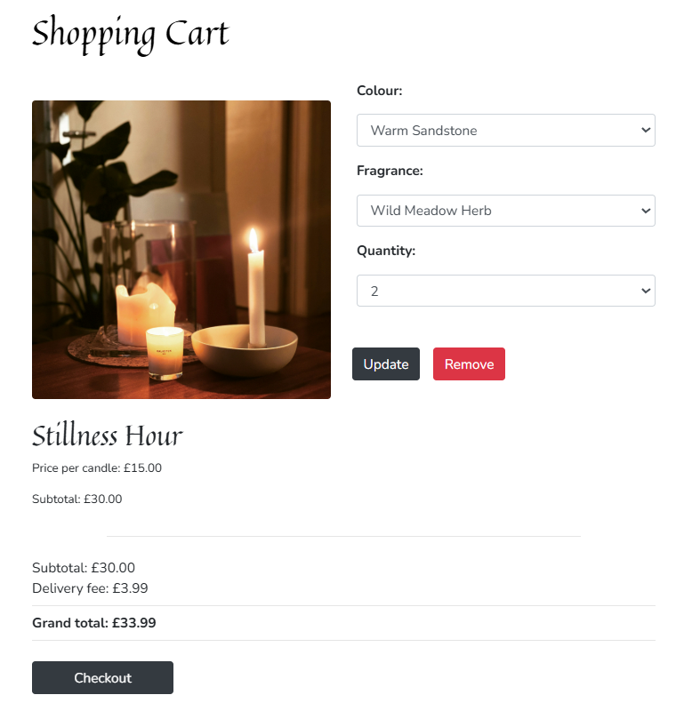|
|Update item|If a cart item's update button is clicked after its colour, fragrance and/or quantity have been changed, the changes are saved, the page is refreshed and a success message is shown|Changed a cart item's colour, fragrance and quantity and clicked the update button|As expected|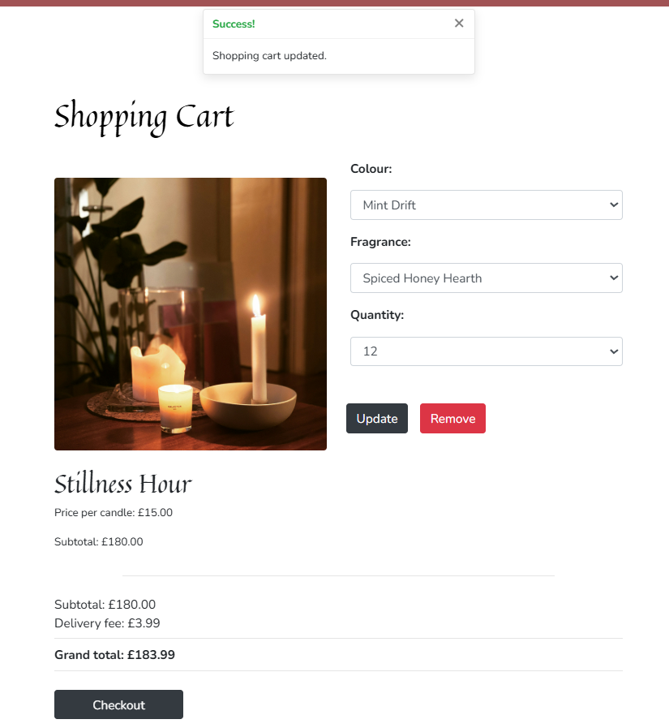|
|Merge items|If a cart item is updated to match the colour, fragrance and product type of another cart item, the two items are combined and their quantities are summed (up to the maximum)|Changed a cart item's colour, fragrance and quantity and clicked the update button|As expected|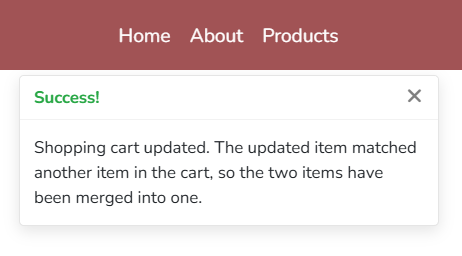|
|Remove item|If the user clicks the Remove button, the item is removed from the cart and a success message is shown|Clicked the remove button|As expected|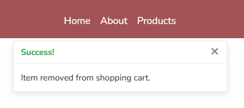|

### Checkout

|Feature|Expect|Action|Result|Image|
|---|---|---|---|---|
|Empty cart validation|If the user tries to visit the checkout page with an empty cart, the user is redirected to the products and an error message is shown|Visited the checkout page with an empty cart|As expected|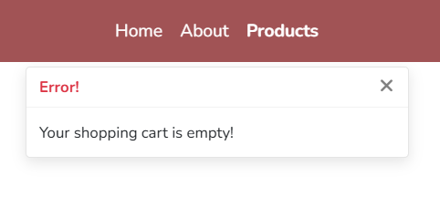|
|Empty field validation|If the user clicks the pay-now button when the form has empty mandatory fields, submission is blocked and a relevant error message is shown|Clicked the pay-now button when the checkout form had empty mandatory fields|As expected|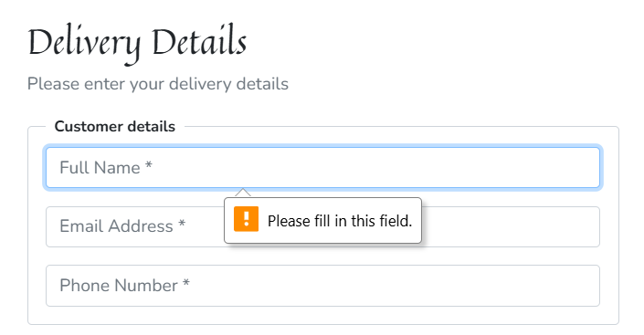|
|Anonymous order submission|If an anonymous user enters valid data into all fields and clicks the pay-now button, the payment is processed, the order is created with no associated user profile, and the user is redirected to the checkout success page|Filled in the checkout form as an anonymous user, clicked the pay-now button|As expected|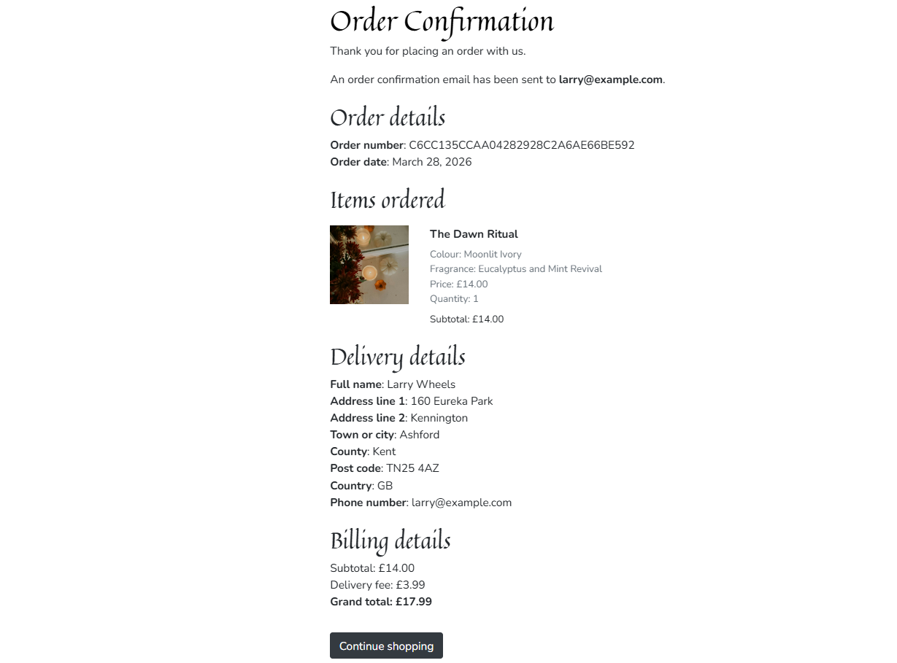|
|Signed-in order submission|If a signed-in user enters valid data into all fields and clicks the pay-now button, the payment is processed, the order is created and associated with the user's profile, and the user is redirected to the checkout success page|Filled in the checkout form as a logged-in user, clicked the pay-now button|As expected|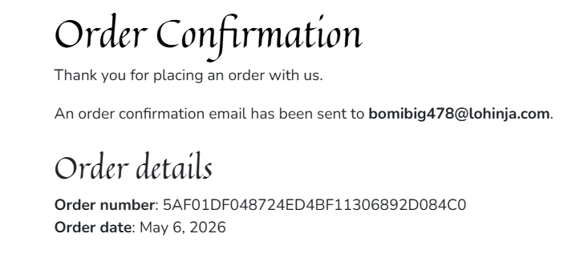|
|Save delivery details|If a signed-in user successfully submits the checkout form with the save-info box ticked, the delivery details are saved to the user's profile|Submitted the checkout form as a signed-in user|As Expected|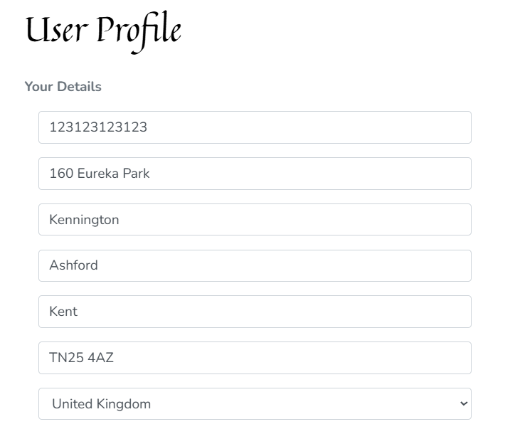|
|Load delivery details|If a signed-in user has previously saved their delivery details to their user profile, the checkout form is auto-filled with those details|Visited the checkout page as a signed-in user with a pre-saved user profile|As Expected|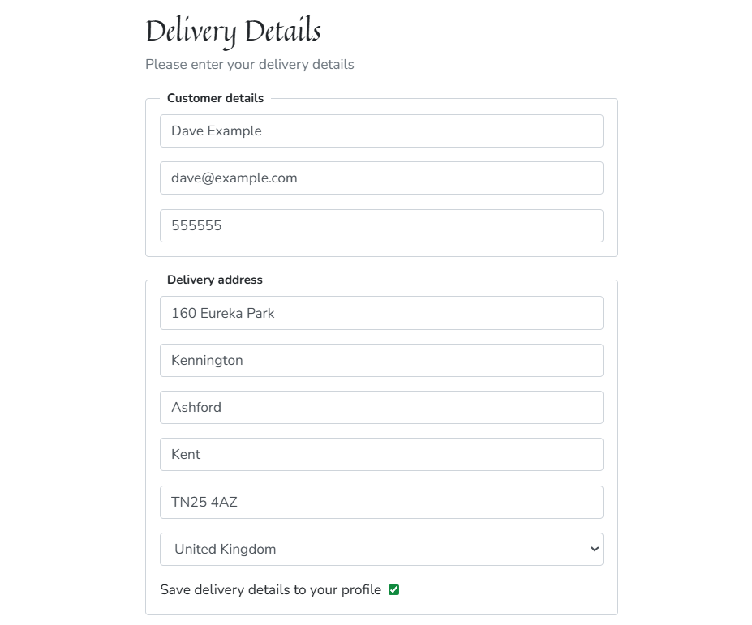|

### Sign Up

Note: New user confirmation emails are not implemented as they're outside the project's scope.

|Feature|Expect|Action|Result|Image|
|---|---|---|---|---|
|Sign-up validation|When the sign-up form is submitted with missing or invalid data, validation messages are shown and the form is not submitted|Tried submitting the sign-up form with various missing and invalid data|As expected|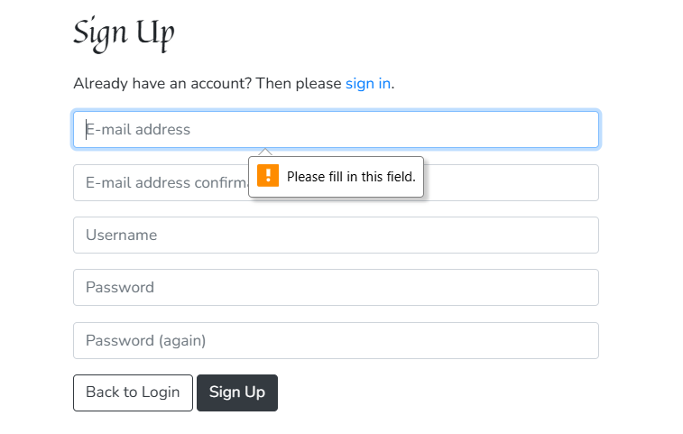|
|Sign-up message|After successfully submitting the sign-up form, a new user profile is created, the user is redirected to the email confirmation page, an info message is shown and a confirmation email is sent to the command line (sending emails to users has not been implemented yet).|Signed up as a new user|As expected|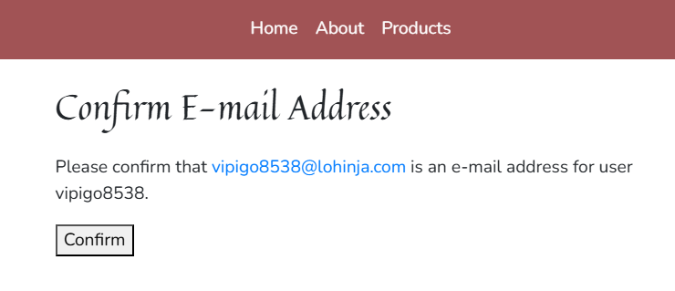|

### Sign In

|Feature|Expect|Action|Result|Image|
|---|---|---|---|---|
|Sign-in empty field validation|When the sign-in form is submitted with missing required fields, a validation message is shown and the form is not submitted|Tried submitting the sign-in form with required fields missing|As expected|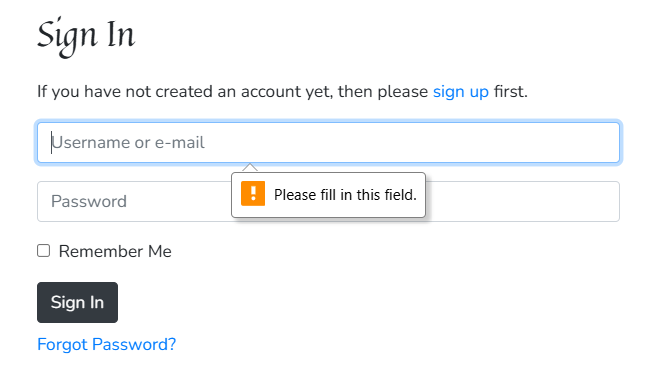|
|Sign-in invalid user validation|When the sign-in form is submitted with invalid user data, a validation message is shown and the form is not submitted|Tried submitting the sign-in form with invalid user data|As expected|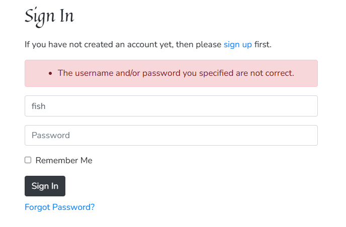|
|Signed-in message|After successfully submitting the sign-in form, the user is signed in, redirected to the home page and a success message is shown|Signed in|As expected|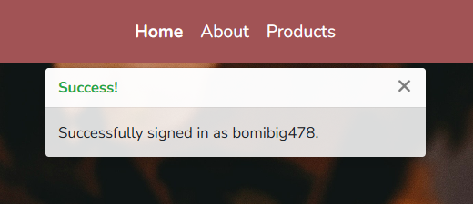|

### Sign Out

|Feature|Expect|Action|Result|Image|
|---|---|---|---|---|
|Sign out|When a signed-in user clicks the sign-out button on the sign-out page, the user is signed out, redirected to the home page and a success message is shown|Clicked the sign-out button|As expected|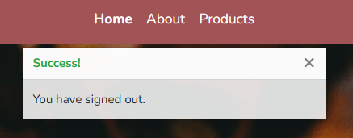|

### User Profile

Note: The ability to save and auto-fill delivery details during checkout were tested in the checkout section above.

|Feature|Expect|Action|Result|Image|
|---|---|---|---|---|
|Update delivery details|When a signed-in user updates their delivery details on the user profile page and clicks the update button, their updated details are saved and a success message is shown|Updated user profile details and clicked the update button|As expected|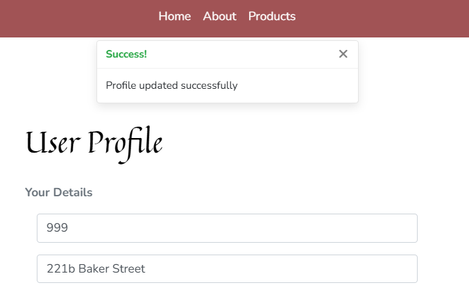|

### 404 Error

|Feature|Expect|Action|Result|Image|
|---|---|---|---|---|
|404 error page|When an invalid path is entered, a helpful error page is shown|Entered an invalid path|As expected|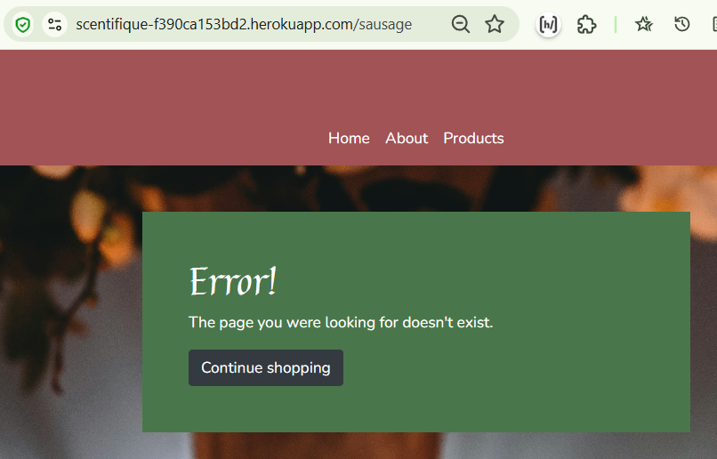|
|continue shopping button|When the continue-shopping button is clicked, the user is taken to the products page|Clicked the button|As expected|None|

## User Stories

Each implemented user story has one or more acceptance criteria that has to be met before the story can be considered done. You can read the acceptance criteria for each user story in the [GitHub Project](https://github.com/users/John-Kingham/projects/15).

All acceptance criteria have been met for implemented user stories, which are listed below for convenience.

### Epic 1: An attractive, trustworthy website
- [x] #1 — As a User, I can see a website that looks good and works well on all screen sizes, so I’m not put off by a poor user experience.  
- [x] #2 — As a User, I can see useful information about the company, so I can decide if it’s trustworthy enough to buy from.  
- [x] #13 — As a User, I can easily find the website through a search engine, so I can visit the site and buy its products.  

### Epic 2: E-commerce capabilities
- [x] #4 — As a User, I can see a list of products on the site, so I can choose products to buy.  
- [x] #6 — As a User, I have a “basket” where I can add or remove multiple items, so I can purchase multiple items in one transaction.  
- [x] #7 — As a User, I can purchase items in my “basket” using a credit/debit card, so I don’t have to send a cheque or cash.  
- [x] #3 — As a User, I can see helpful feedback on each important action I take on the site, so that I always know whether my actions were successful or not.  
- [x] #8 — As a Logged-in User, I can save my address, so I don’t have to enter it manually for future orders.  
- [x] #5 — As an Admin, I can create, update and delete product information through a well-designed front end, so I don’t have to switch back and forth between the site's front-end and admin area.  

### Epic 3: E-newsletter
- [x] #11 — As a User, I can sign-up to a regular email newsletter, so I can find out more about candlemaking and the latest candles and offers.  

## Colour Contrast

I tested colour contrasts using [WebAIM](https://webaim.org/).

### White + Custom Red

The header and footer sections use a custom red background and white text.

All tests passed.

Screenshot

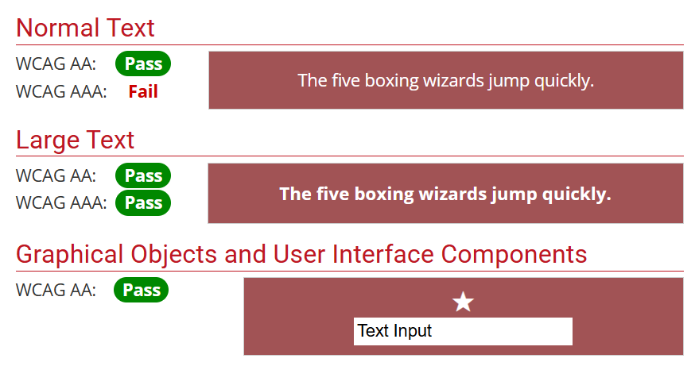

### White + Custom Green

The home page hero section uses a custom green background and white text.

All tests passed.

Screenshot

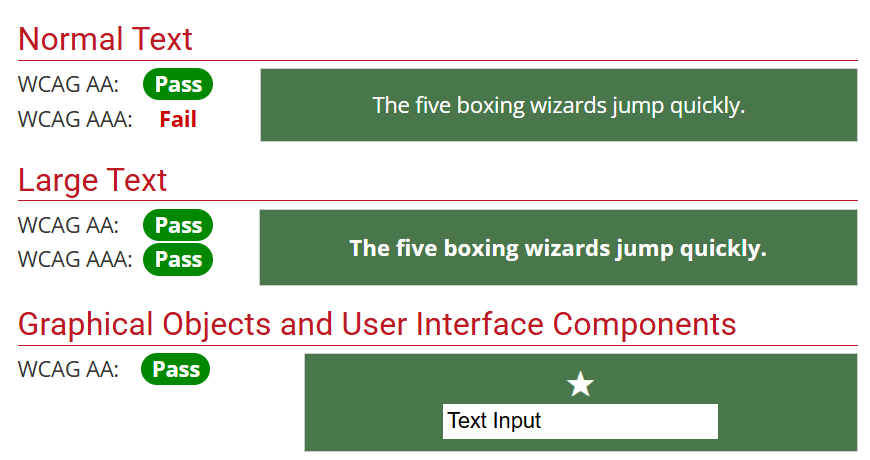

## Accessibility

I tested accessibility using the [WAVE](https://wave.webaim.org/) accessibility evaluation tool from WebAIM.

- 2 Errors - These were for missing form labels and were caused by the embedded e-newsletter form, the code for which is outside of my control.
- 2 Contrast Errors - These were for Very Low Contrast and this was also caused by the embedded e-newsletter form, the styling of which is outside of my control.

Screenshot

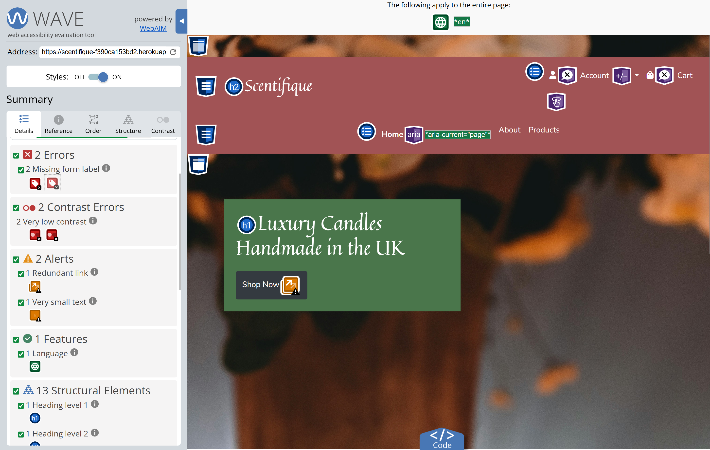

## Responsiveness

|Section|Mobile Responsive?|Tablet Responsive?|Desktop Responsive?|
|---|---|---|---|
|Header Nav|Yes|Yes|Yes|
|Homepage Hero|Yes|Yes|Yes|
|Contact Details|Yes|Yes|Yes|
|Product List|Yes|Yes|Yes|
|Product Detail|Yes|Yes|Yes|
|Add Product|Yes|Yes|Yes|
|Edit Product|Yes|Yes|Yes|
|About|Yes|Yes|Yes|
|Shopping Basket|Yes|Yes|Yes|
|Checkout|Yes|Yes|Yes|
|Order Confirmation|Yes|Yes|Yes|
|User Profile|Yes|Yes|Yes|
|404 Error|Yes|Yes|Yes|

### Responsiveness Screenshots

Homepage - Mobile

Homepage - Tablet

Homepage - Desktop

Product List - Mobile

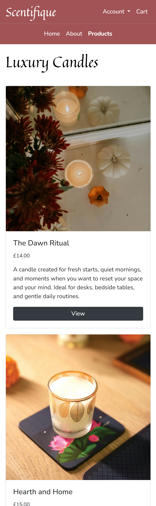

Product List - Tablet

Product List - Desktop

Product Detail - Mobile

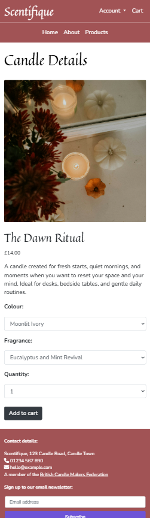

Product Detail - Tablet

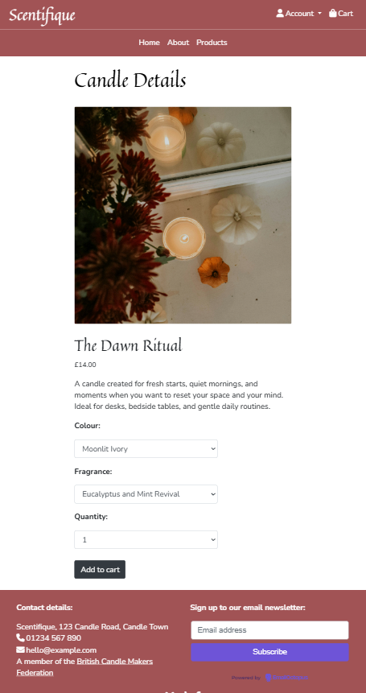

Product Detail - Desktop

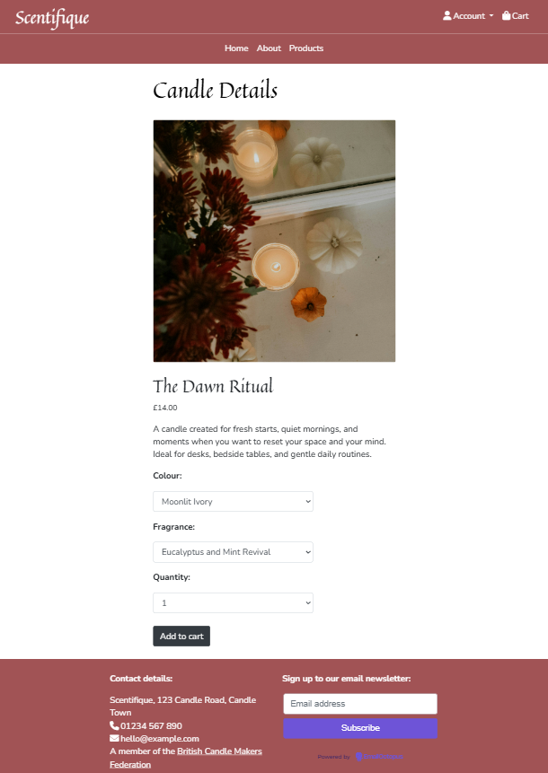

Add Product - Mobile

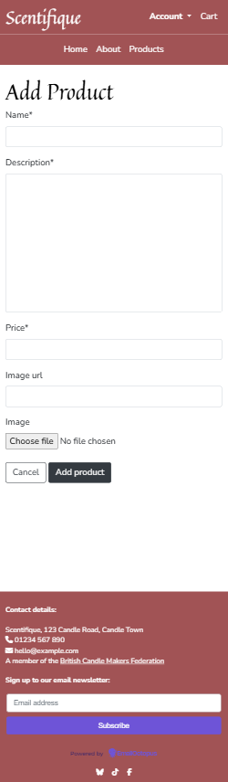

Add Product - Tablet

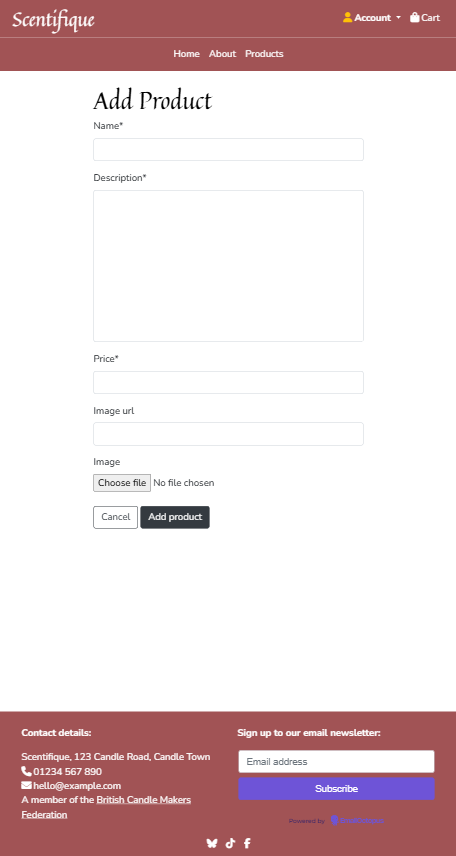

Add Product - Desktop

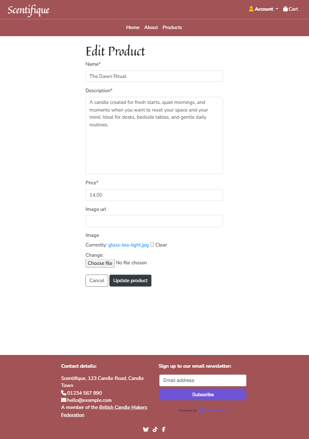

Edit Product - Mobile

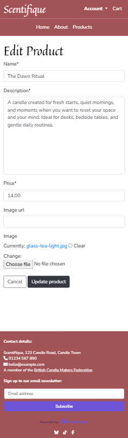

Edit Product - Tablet

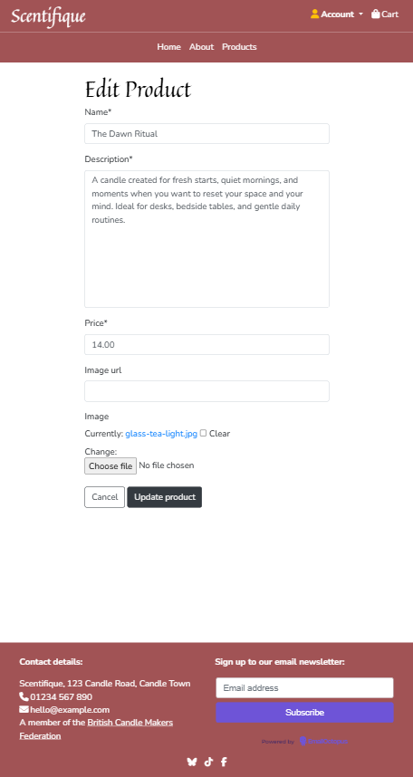

Edit Product - Desktop

About - Mobile

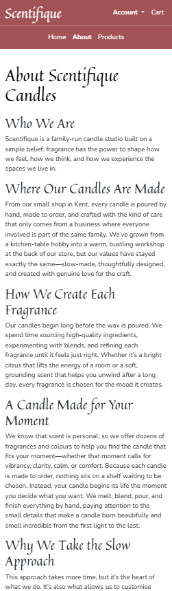

About - Tablet

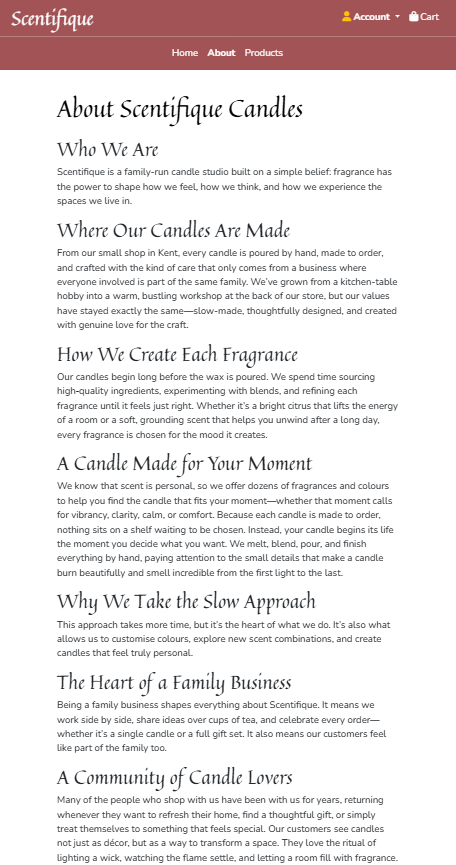

About - Desktop

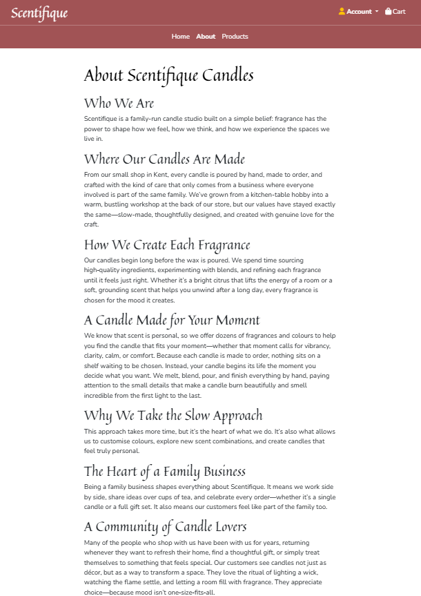

Shopping Basket - Mobile

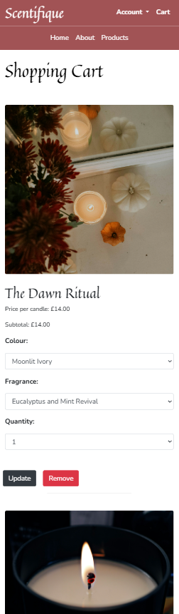

Shopping Basket - Tablet

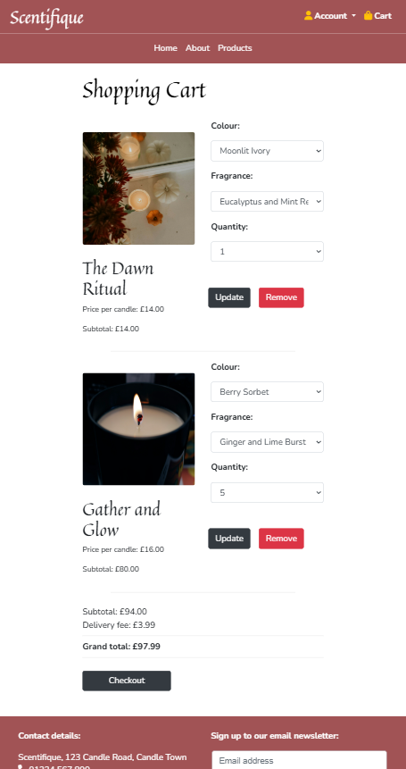

Shopping Basket - Desktop


Checkout - Mobile


Checkout - Tablet


Checkout - Desktop


Order Confirmation - Mobile


Order Confirmation - Tablet


Order Confirmation - Desktop


User Profile - Mobile


User Profile - Tablet


User Profile - Desktop

404 Error - Mobile


404 Error - Tablet


404 Error - Desktop


## Browsers

The site's functionality and responsiveness were tested on Chrome, Edge and Firefox, as these are some of the most popular browsers.

|Test|Chrome|Edge|Firefox|
|---|---|---|---|
|Header Nav as expected?|Yes|Yes|Yes|
|Homepage Hero as expected?|Yes|Yes|Yes|
|Contact Details as expected?|Yes|Yes|Yes|
|Product List as expected?|Yes|Yes|Yes|
|Product Detail as expected?|Yes|Yes|Yes|
|Add Product as expected?|Yes|Yes|Yes|
|Edit Product as expected?|Yes|Yes|Yes|
|About as expected?|Yes|Yes|Yes|
|Shopping Basket as expected?|Yes|Yes|Yes|
|Checkout as expected?|Yes|Yes|Yes|
|Order Confirmation as expected?|Yes|Yes|Yes|
|User Profile as expected?|Yes|Yes|Yes|
|404 Error as expected?|Yes|Yes|Yes|

### Browser Screenshots

All of the screenshots in the sections above were taken on Chrome. Rather than include every screenshot for every browser, here are a few screenshots from Edge and Firefox showing similar results to Chrome:

Home - Desktop - Firefox

Product List - Tablet - Firefox


Product Detail - Mobile - Edge


Shopping Basket - Desktop - Edge


## Code Validation

### HTML Validation

HTML was validated using the [W3C Markup Validation Service](https://validator.w3.org/).

There were various validation errors and warnings in the site's HTML, but all errors and warnings have now been resolved.

#### Homepage HTML Validation


#### Product List HTML Validation


#### Product Detail HTML Validation


#### Add Product HTML Validation


#### Edit Product HTML Validation


#### About HTML Validation


#### Shopping Basket HTML Validation


#### Checkout HTML Validation


#### Order Confirmation HTML Validation

For the order confirmation page, I had to validate the source code rather than the URL, as the validator was unable to reload the page.


#### User Profile HTML Validation


#### 404 Error HTML Validation

For the 404 page, I had to validate the source code rather than the URL, as the validator was unable to load an invalid URL.


### CSS Validation

CSS validation was carried out using the [W3C CSS Validation Service](https://jigsaw.w3.org/css-validator/).

There were no errors or warnings.

#### base.css Validation


#### checkout.css Validation


#### profile.css Validation


### JavaScript Validation

JavaScript validation was carried out using [JSHint](https://jshint.com/).

There were no errors. There were warnings related to missing variables for $ (JQuery) and stripe, and these are expected as those variables are loaded externally and are therefore not available in JSHint. 

#### cart.html inline JS


#### base.html inline JS


#### stripe_elements.js


#### profile.js


### Python Validation

Python code was validated using [flake8](https://pypi.org/project/flake8/).

There were multiple errors relating to unused imports. These errors are acceptable as they're caused by default code in Django's python files that haven't been changed as part of the project.


## Lighthouse

Performance was "okay" (amber) on some path/device combinations, mostly due to external libraries such as Amazon Web Services, Stripe and Bootstrap.

Best practice was "okay" (amber) due to the existence of third-party cookies from Stripe and Google's reCAPTHCA service.

|Path|Device|Result|
|---|---|---|
|/|Mobile||
|/|Desktop||
|products/|Mobile||
|products/|Desktop||
|products/<product_id>/|mobile||
|products/<product_id>/|desktop||
|products/add/|mobile||
|products/add/|desktop||
|products/edit/<product_id>/|mobile||
|products/edit/<product_id>/|desktop||
|about/|mobile||
|about/|desktop||
|cart/|mobile||
|cart/|desktop||
|checkout/|mobile||
|checkout/|desktop||
|checkout/success/|mobile & desktop|As expected, testing wasn't possible as Lighthouse couldn't load the page|
|profile/|mobile||
|profile/|desktop||
|<invalid_url>/|mobile||
|<invalid_url>/|desktop||
